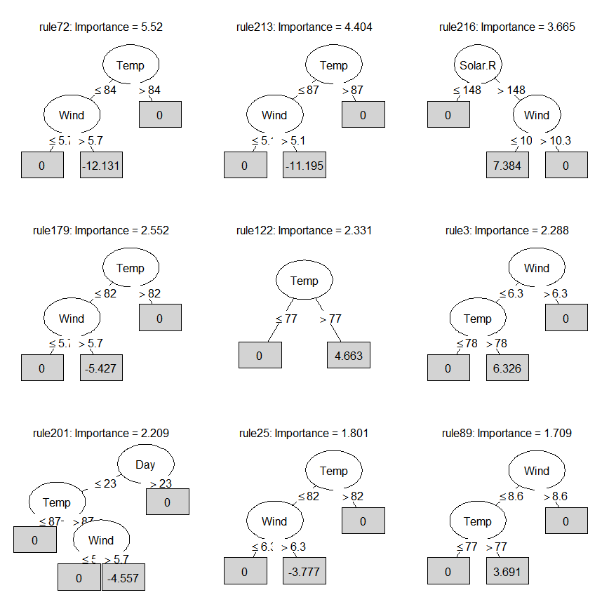
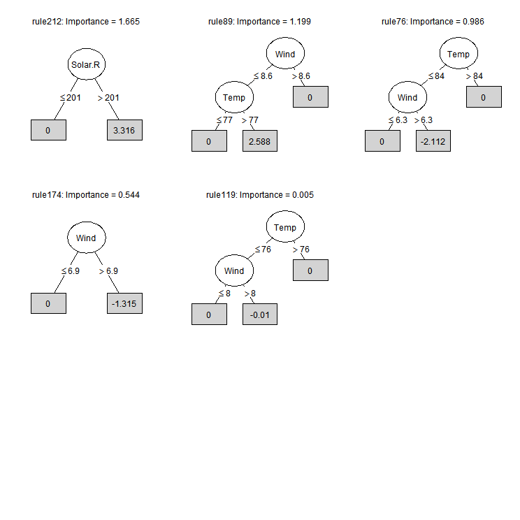
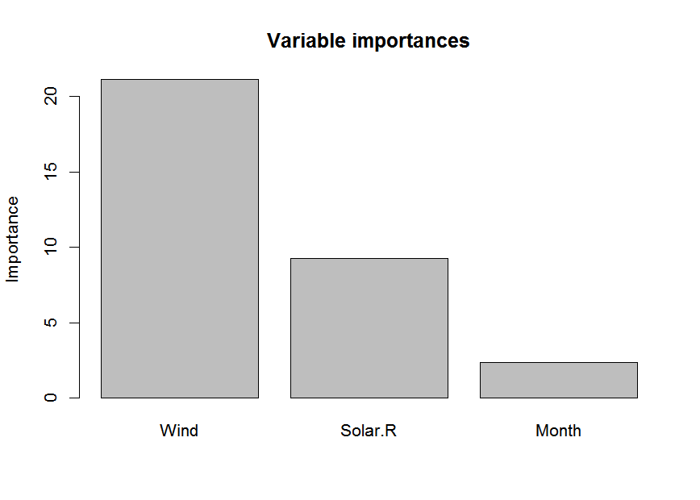
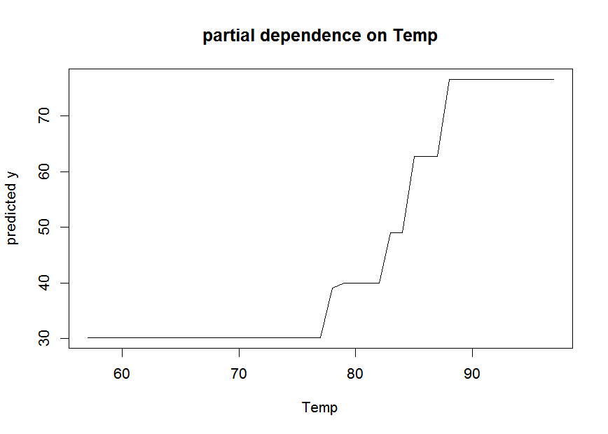
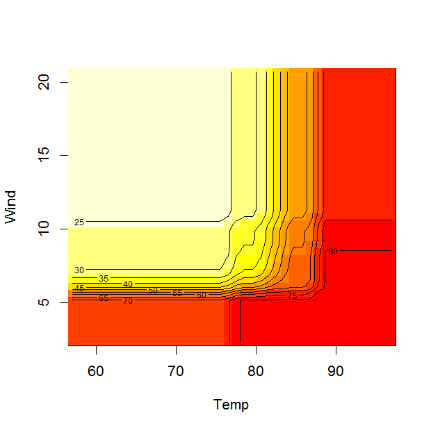

pre: an R package for deriving prediction rule ensembles
========================================================

pre is an R package for deriving prediction rule ensembles for binary and continuous outcome variables. Input variables may be numeric, ordinal and nominal. The package implements the algorithm for deriving prediction rule ensembles as described in Friedman & Popescu (2008), with several adjustments:

1.  The package is completely R based, allowing users better accessible results and more control over the parameters used for generating the prediction rule ensemble.
2.  The unbiased tree induction algorithm of Hothorn, Hornik, & Zeileis (2006) is used for deriving prediction rules, instead of the classification and regression tree (CART) algorithm, which suffers from biased variable selection.
3.  The package allows for plotting the final rule ensemble as a collection of simple decision trees.
4.  The initial ensemble of prediction rules can be generated as a bagged, boosted and/or random forest ensemble.
5.  Hinge functions of predictor variables may be included as baselearners in the ensemble, as in the multivariate adaptive regression splines technique of Friedman (1991).

The pre package is developed to provide useRs a completely R based implementation of the algorithm described by Friedman & Popescu (2008). However, note that pre is under development, and much work still needs to be done. See Fokkema, Smits, Kelderman, & Penninx (2015) for an application of the methods.

Examples
========

To get a first impression of how pre works, we will fit a prediction rule ensemble to predict Ozone levels using the airquality dataset. WE can fit a prediction rule ensemble using the pre() function:

``` r
library(pre)
set.seed(42)
airq.ens <- pre(Ozone ~ ., data = airquality[complete.cases(airquality), ])
```

We can print the resulting ensemble using the print function():

``` r
print(airq.ens)
#> 
#> Final ensemble with cv error within 1se of minimum: 
#>   lambda =  1.607146
#>   number of terms = 14
#>   mean cv error (se) = 299.798 (74.28342) 
#> 
#>          rule    coefficient                          description
#>   (Intercept)   62.658099734                                 <NA>
#>        rule72  -13.401881493              Wind > 5.7 & Temp <= 84
#>       rule216    8.166292702         Wind <= 10.3 & Solar.R > 148
#>       rule122    8.027236520                            Temp > 77
#>       rule213   -7.901556274              Wind > 5.1 & Temp <= 87
#>       rule201   -6.587690267  Wind > 5.7 & Temp <= 87 & Day <= 23
#>        rule25   -5.524545249              Wind > 6.3 & Temp <= 82
#>       rule179   -4.981266386              Wind > 5.7 & Temp <= 82
#>         rule3    4.927105788              Temp > 78 & Wind <= 6.3
#>       rule149   -3.427067580                Temp <= 87 & Wind > 8
#>       rule212    3.315627932                        Solar.R > 201
#>        rule89    2.588377937              Temp > 77 & Wind <= 8.6
#>        rule76   -2.112110981              Wind > 6.3 & Temp <= 84
#>       rule174   -1.315368661                           Wind > 6.9
#>       rule119   -0.009507402                Wind > 8 & Temp <= 76
```

We can plot the rules and linear terms in the ensemble using the plot() function:

``` r
plot(airq.ens, penalty.par.val = "lambda.1se", max.terms.plot = 9, cex = .6)
```



We can obtain the estimated coefficients for each of the baselearners using the coef() function:

``` r
coefs <- coef(airq.ens)
coefs[1:6,]
#>            rule coefficient                         description
#> 194 (Intercept)   62.658100                                <NA>
#> 56       rule72  -13.401881             Wind > 5.7 & Temp <= 84
#> 170     rule216    8.166293        Wind <= 10.3 & Solar.R > 148
#> 95      rule122    8.027237                           Temp > 77
#> 167     rule213   -7.901556             Wind > 5.1 & Temp <= 87
#> 159     rule201   -6.587690 Wind > 5.7 & Temp <= 87 & Day <= 23
```

We can assess the importance of the input variables as well as the baselearners in the ensemble using the importance() function:

``` r
importance(airq.ens, round = 4)
```



    #> $varimps
    #>   varname     imp
    #> 1    Temp 14.9921
    #> 2    Wind 13.5507
    #> 3 Solar.R  3.6914
    #> 4     Day  1.0646
    #> 
    #> $baseimps
    #>       rule                         description    imp coefficient     sd
    #> 1   rule72             Wind > 5.7 & Temp <= 84 6.0981    -13.4019 0.4550
    #> 2  rule216        Wind <= 10.3 & Solar.R > 148 4.0533      8.1663 0.4963
    #> 3  rule122                           Temp > 77 4.0120      8.0272 0.4998
    #> 4  rule201 Wind > 5.7 & Temp <= 87 & Day <= 23 3.1939     -6.5877 0.4848
    #> 5  rule213             Wind > 5.1 & Temp <= 87 3.1087     -7.9016 0.3934
    #> 6   rule25             Wind > 6.3 & Temp <= 82 2.6332     -5.5245 0.4766
    #> 7  rule179             Wind > 5.7 & Temp <= 82 2.3424     -4.9813 0.4702
    #> 8    rule3             Temp > 78 & Wind <= 6.3 1.7825      4.9271 0.3618
    #> 9  rule149               Temp <= 87 & Wind > 8 1.6771     -3.4271 0.4894
    #> 10 rule212                       Solar.R > 201 1.6647      3.3156 0.5021
    #> 11  rule89             Temp > 77 & Wind <= 8.6 1.1985      2.5884 0.4630
    #> 12  rule76             Wind > 6.3 & Temp <= 84 0.9858     -2.1121 0.4667
    #> 13 rule174                          Wind > 6.9 0.5439     -1.3154 0.4135
    #> 14 rule119               Wind > 8 & Temp <= 76 0.0046     -0.0095 0.4796

We can generate predictions for new observations using the predict() function:

``` r
airq.preds <- predict(airq.ens, newdata = airquality[1:4,])
```

We can obtain a partial dependence plot to assess the effect of a single predictor variable on the outcome using the singleplot() function:

``` r
singleplot(airq.ens, varname = "Temp")
```



We can obtain a partial dependence plot to assess the effect of a pair of predictor variables on the outcome using the pairplot() function:

``` r
pairplot(airq.ens, varnames = c("Temp", "Wind"))
```



    #> NOTE: function pairplot uses package 'akima', which has an ACM license.
    #>     See also https://www.acm.org/publications/policies/software-copyright-notice.

We can assess the expected prediction error of the ensemble through cross validation (10-fold, by default) using the cvpre() function:

``` r
set.seed(43)
airq.cv <- cvpre(airq.ens)
airq.cv$accuracy
#> $MSE
#>       MSE        se 
#> 365.97383  84.68306 
#> 
#> $MAE
#>       MAE        se 
#> 13.775890  1.265625
```

More complex prediction ensembles can be obtained using the gpe() function. The abbreviation gpe stands for generalized prediction ensembles, which may include hinge functions of the predictor variables as described in Friedman (1991), in addition to rules and/or linear terms. Addition of such hinge functions may improve predictive accuracy (but may also reduce interpretability).

References
==========

Fokkema, M., Smits, N., Kelderman, H., & Penninx, B. W. (2015). Connecting clinical and actuarial prediction with rule-based methods. *Psychological Assessment*, *27*(2), 636.

Friedman, J. H. (1991). Multivariate adaptive regression splines. *The Annals of Statistics*, 1–67.

Friedman, J. H., & Popescu, B. E. (2008). Predictive learning via rule ensembles. *The Annals of Applied Statistics*, *2*(3), 916–954. Retrieved from <http://www.jstor.org/stable/30245114>

Hothorn, T., Hornik, K., & Zeileis, A. (2006). Unbiased recursive partitioning: A conditional inference framework. *Journal of Computational and Graphical Statistics*, *15*(3), 651–674.
