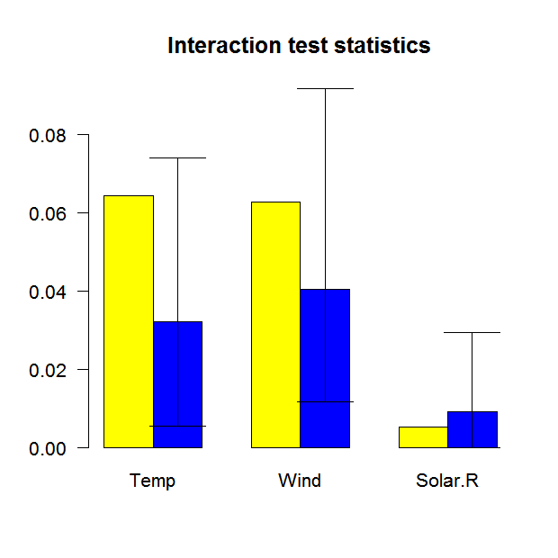

pre: an R package for deriving prediction rule ensembles
========================================================

pre is an R package for deriving prediction rule ensembles for binary, continuous and count outcome variables. Input variables may be numeric, ordinal and nominal. An extensive description of the implementation and functionality is provided in Fokkema (2017). The package largely implements the algorithm for deriving prediction rule ensembles as described in Friedman & Popescu (2008), with several adjustments:

1.  The package is completely R based, allowing users better access to the results and more control over the parameters used for generating the prediction rule ensemble.
2.  The unbiased tree induction algorithm of Hothorn, Hornik, & Zeileis (2006) is used for deriving prediction rules, instead of the classification and regression tree (CART) algorithm, which suffers from biased variable selection.
3.  The packake supports continuous, binary and count response variables
4.  The package allows for plotting the final rule ensemble as a collection of simple decision trees.
5.  The initial ensembles may be generated as in bagging, boosting and/or random forests.
6.  Hinge functions of predictor variables may be included as baselearners, like in the multivariate adaptive regression splines method of Friedman (1991), using the gpe() function.

Note that pre is under development, and much work still needs to be done.

Example: Prediction rule ensemble for predicting ozone levels
-------------------------------------------------------------

To get a first impression of how pre works, we will fit a prediction rule ensemble to predict Ozone levels using the airquality dataset. We can fit a prediction rule ensemble using the pre() function:

``` r
library(pre)
set.seed(42)
airq.ens <- pre(Ozone ~ ., data = airquality[complete.cases(airquality), ])
```

We can print the resulting ensemble (alternatively, we could use the `print` method):

``` r
airq.ens
#> 
#> Final ensemble with cv error within 1se of minimum: 
#>   lambda =  2.331694
#>   number of terms = 13
#>   mean cv error (se) = 302.4644 (79.28454)
#> 
#>   cv error type : Mean-Squared Error
#> 
#>          rule  coefficient                          description
#>   (Intercept)   72.9680699                                 <NA>
#>       rule191  -15.6401488              Wind > 5.7 & Temp <= 87
#>       rule173   -8.6645924              Wind > 5.7 & Temp <= 82
#>       rule204    8.1715564         Wind <= 10.3 & Solar.R > 148
#>        rule42   -7.6928586              Wind > 6.3 & Temp <= 84
#>        rule10   -6.8032890              Temp <= 84 & Temp <= 77
#>       rule192   -4.6926624  Wind > 5.7 & Temp <= 87 & Day <= 23
#>        rule93    3.1468762              Temp > 77 & Wind <= 8.6
#>        rule51   -2.6981570              Wind > 5.7 & Temp <= 84
#>        rule25   -2.4481192              Wind > 6.3 & Temp <= 82
#>        rule28   -2.1119330              Temp <= 84 & Wind > 7.4
#>        rule74   -0.8276940              Wind > 6.9 & Temp <= 84
#>       rule200   -0.4479854                       Solar.R <= 201
#>       rule166   -0.1202175              Wind > 6.9 & Temp <= 82
```

We can plot the baselarners in the ensemble using the `plot` method (note that only the nine most important baselearners are requested here):

``` r
plot(airq.ens, nterms = 9, cex = .5)
```


We can obtain the estimated coefficients for each of the baselearners using the `coef` method:

``` r
coefs <- coef(airq.ens)
coefs[1:10,]
#>            rule coefficient                         description
#> 201 (Intercept)   72.968070                                <NA>
#> 166     rule191  -15.640149             Wind > 5.7 & Temp <= 87
#> 149     rule173   -8.664592             Wind > 5.7 & Temp <= 82
#> 178     rule204    8.171556        Wind <= 10.3 & Solar.R > 148
#> 39       rule42   -7.692859             Wind > 6.3 & Temp <= 84
#> 10       rule10   -6.803289             Temp <= 84 & Temp <= 77
#> 167     rule192   -4.692662 Wind > 5.7 & Temp <= 87 & Day <= 23
#> 84       rule93    3.146876             Temp > 77 & Wind <= 8.6
#> 48       rule51   -2.698157             Wind > 5.7 & Temp <= 84
#> 23       rule25   -2.448119             Wind > 6.3 & Temp <= 82
```

We can assess the importance of input variables as well as baselearners using the `importance()` function:

``` r
importance(airq.ens, round = 4)
```


We can generate predictions for new observations using the `predict` method:

``` r
predict(airq.ens, newdata = airquality[1:4,])
#>        1        2        3        4 
#> 31.10390 20.82041 20.82041 21.26840
```

We can obtain partial dependence plots to assess the effect of single predictor variables on the outcome using the `singleplot()` function:

``` r
singleplot(airq.ens, varname = "Temp")
```


We can obtain partial dependence plots to assess the effects of pairs of predictor variables on the outcome using the `pairplot()` function:

``` r
pairplot(airq.ens, varnames = c("Temp", "Wind"))
#> Warning in if (!(varnames %in% object$x_names == c(TRUE, TRUE))) {: the
#> condition has length > 1 and only the first element will be used
#> Loading required namespace: akima
#> NOTE: function pairplot uses package 'akima', which has an ACM license. See also https://www.acm.org/publications/policies/software-copyright-notice.
```


We can assess the expected prediction error of the prediction rule ensemble through cross validation (10-fold, by default) using the `cvpre()` function:

``` r
set.seed(43)
airq.cv <- cvpre(airq.ens)
airq.cv$accuracy
#> $MSE
#>       MSE        se 
#> 364.64985  83.83141 
#> 
#> $MAE
#>      MAE       se 
#> 13.75209  1.26322
```

We can assess the presence of input variable interactions using the `interact()` and `bsnullinteract()` funtions:

``` r
set.seed(44)
nullmods <- bsnullinteract(airq.ens)
int <- interact(airq.ens, nullmods = nullmods, c("Temp", "Wind", "Solar.R"))
```



We can check assess correlations between the baselearners using the `corplot()` function:

``` r
corplot(airq.ens)
```


Including hinge functions
-------------------------

More complex prediction ensembles can be obtained using the `gpe()` function. The abbreviation gpe stands for generalized prediction ensembles, which may include hinge functions of the predictor variables as described in Friedman (1991), in addition to rules and/or linear terms. Addition of such hinge functions may improve predictive accuracy. More information about fitting generalized prediction ensembles can be obtained by typing:

``` r
?gpe
```

References
----------

Fokkema, M. (2017). Pre: An r package for fitting prediction rule ensembles. *ArXiv:1707.07149*. Retrieved from <https://arxiv.org/abs/1707.07149>

Friedman, J. H. (1991). Multivariate adaptive regression splines. *The Annals of Statistics*, *19*(1), 1–67.

Friedman, J. H., & Popescu, B. E. (2008). Predictive learning via rule ensembles. *The Annals of Applied Statistics*, *2*(3), 916–954. Retrieved from <http://www.jstor.org/stable/30245114>

Hothorn, T., Hornik, K., & Zeileis, A. (2006). Unbiased recursive partitioning: A conditional inference framework. *Journal of Computational and Graphical Statistics*, *15*(3), 651–674.
