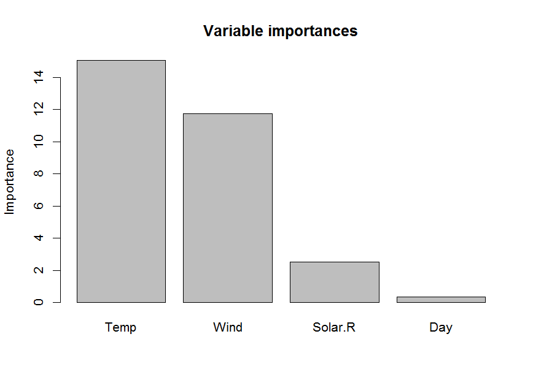
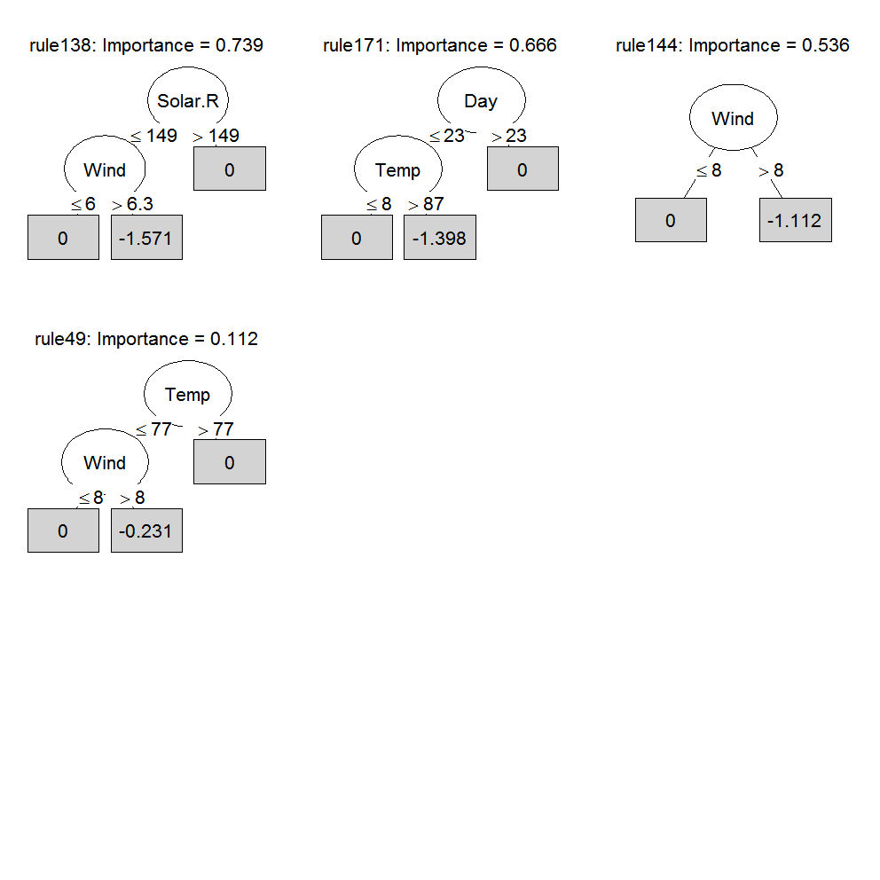
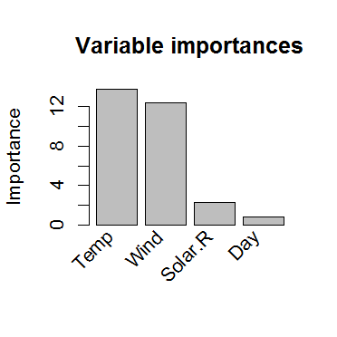
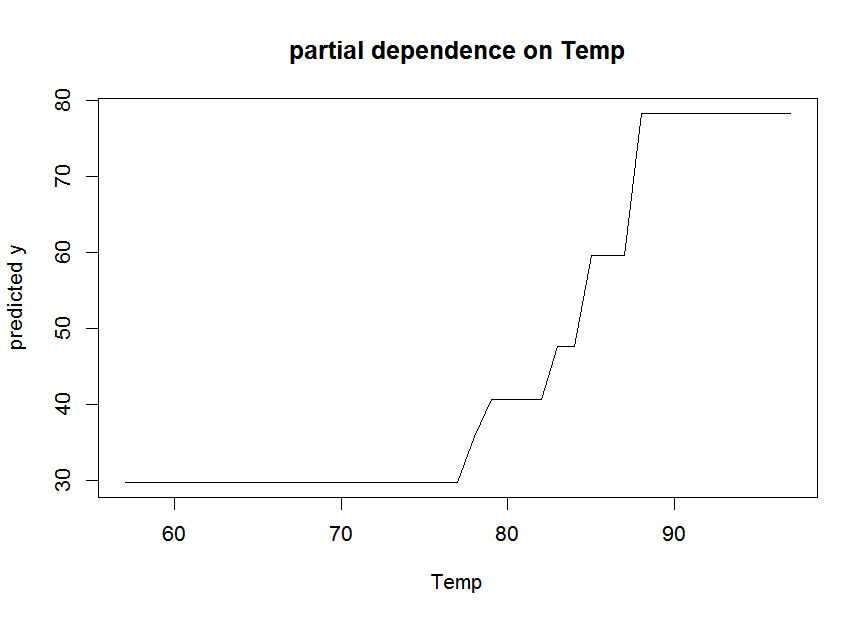

pre is an R package for deriving prediction rule ensembles for binary and continuous outcome variables. Input variables may be numeric, ordinal and nominal. The package implements the algorithm for deriving prediction rule ensembles as described in (Friedman and Popescu 2008), with some improvements and adjustments. The most important improvements and adjustments are:

1.  The pre package is completely R based, allowing users better access to the results and more control over the parameters used for generating the prediction rule ensemble
2.  An unbiased tree induction algorithm is used for deriving prediction rules. Friedman & Popescu used the classification and regression tree (CART) algorithm, but this suffers from biased variable selection.
3.  The package allows for plotting the final rule ensemble as a collection of simple decision trees.
4.  The initial ensemble of prediction rules can be generated as a bagged, boosted and/or random forest ensemble.

The pre package is developed to provide useRs a completely R based implementation of the algorithm described by (Friedman and Popescu 2008). However, note that pre is under development, and much work still needs to be done. See (Fokkema et al. 2015) for an application of the methods.

Examples
========

To get a first impression of how pre works, consider the following example of prediction rule ensemble, using the airquality dataset:

``` r
library(pre)
set.seed(3428488)
is_complete <- complete.cases(airquality)
airq.ens <- pre(Ozone ~ ., data = airquality[is_complete, ], verbose = TRUE)
#> A rule ensemble for prediction of a continuous output variable will 
#>           be created.
#> 
#> A total of 500 trees and  887 rules were 
#>           generated initially.
#> 
#> A total of 648 rules were empty
#>             and removed from the initial ensemble.
#> 
#> A total of 20 generated rules had 
#>               support identical to earlier rules and were removed from the initial 
#>               ensemble ($duplicates.removed shows which, if any).
#> 
#> A total of 2 generated rules had 
#>              support that was the complement of the support of earlier rules and were removed from the initial 
#>              ensemble ($complements.removed shows which, if any).
#> 
#> An initial ensemble consisting of 187 rules was 
#>             succesfully created.
#> 
#> Final ensemble with minimum cv error: 
#>   lambda = 0.7635248
#>   number of terms = 21
#>   mean cv error (se) = 235.6417 (58.31193)
#> 
#> Final ensemble with cv error within 1se of minimum: 
#>   lambda = 2.331694
#>   number of terms = 13
#>   mean cv error (se) = 293.3763 (78.56292)
print(airq.ens, penalty.par.val = "lambda.1se")
#> 
#> Final ensemble with cv error within 1se of minimum: 
#>   lambda =  2.331694
#>   number of terms = 13
#>   mean cv error (se) = 293.3763 (78.56292) 
#> 
#>          rule  coefficient                  description
#>   (Intercept)   68.7271555                         <NA>
#>       rule134  -19.8479022      Wind > 5.7 & Temp <= 87
#>       rule206    9.3707140    Solar.R > 201 & Temp > 78
#>       rule129    6.3302852      Temp > 77 & Wind <= 8.6
#>       rule127   -5.3732463      Wind > 5.7 & Temp <= 84
#>        rule18   -5.3074522      Wind > 6.3 & Temp <= 84
#>        rule54   -4.5523606      Wind > 6.3 & Temp <= 82
#>        rule78   -3.7757836      Temp <= 84 & Wind > 7.4
#>        rule32   -3.6229508      Wind > 5.7 & Temp <= 82
#>       rule103    3.5182200                    Temp > 77
#>       rule138   -1.5708229  Wind > 6.3 & Solar.R <= 149
#>       rule171   -1.3978472       Temp <= 87 & Day <= 23
#>       rule144   -1.1118169                     Wind > 8
#>        rule49   -0.2308569        Wind > 8 & Temp <= 77
```

``` r
print(airq.ens, penalty.par.val = "lambda.min")
#> Final ensemble with minimum cv error: 
#> 
#>   lambda =  0.7635248
#>   number of terms = 21
#>   mean cv error (se) = 235.6417 (58.31193) 
#> 
#>          rule   coefficient                              description
#>   (Intercept)   79.42437736                                     <NA>
#>       rule134  -26.13161095                  Wind > 5.7 & Temp <= 87
#>       rule127  -13.89343420                  Wind > 5.7 & Temp <= 84
#>       rule206    9.42623530                Solar.R > 201 & Temp > 78
#>        rule21    6.95362622                   Temp <= 86 & Temp > 77
#>       rule218    6.93836920                Solar.R > 220 & Wind <= 8
#>        rule54   -6.04536943                  Wind > 6.3 & Temp <= 82
#>       rule171   -4.08559369                   Temp <= 87 & Day <= 23
#>        rule40    3.79406451                  Temp > 78 & Wind <= 6.9
#>       rule138   -3.48840978              Wind > 6.3 & Solar.R <= 149
#>        rule58   -3.23716044  Wind > 6.3 & Temp <= 82 & Solar.R <= 78
#>       rule144   -2.09730518                                 Wind > 8
#>       rule191   -1.29902040                              Wind > 10.3
#>       rule129    1.15288009                  Temp > 77 & Wind <= 8.6
#>       rule177   -1.09430440                  Wind > 6.3 & Temp <= 83
#>       rule195   -0.89671839                     Wind > 8 & Day <= 15
#>       rule140    0.66133317                              Wind <= 8.6
#>        rule92   -0.46512868                  Temp <= 83 & Wind > 7.4
#>          Wind   -0.26129747                    3.85 <= Wind <= 17.05
#>       rule104   -0.23720998                  Wind > 5.7 & Temp <= 83
#>       rule236    0.02337044                Solar.R > 197 & Wind <= 8
#>        rule32   -0.00360309                  Wind > 5.7 & Temp <= 82
```

``` r
# Let's take the smallest ensemble yielding a cross-validated error within 1se 
# of the minimum (this is the default in all pre functions): 

# Inspect the prediction rule ensemble:
head(coef(airq.ens), 10)
#>            rule coefficient               description
#> 188 (Intercept)   68.727155                      <NA>
#> 105     rule134  -19.847902   Wind > 5.7 & Temp <= 87
#> 163     rule206    9.370714 Solar.R > 201 & Temp > 78
#> 102     rule129    6.330285   Temp > 77 & Wind <= 8.6
#> 100     rule127   -5.373246   Wind > 5.7 & Temp <= 84
#> 14       rule18   -5.307452   Wind > 6.3 & Temp <= 84
#> 39       rule54   -4.552361   Wind > 6.3 & Temp <= 82
#> 58       rule78   -3.775784   Temp <= 84 & Wind > 7.4
#> 22       rule32   -3.622951   Wind > 5.7 & Temp <= 82
#> 79      rule103    3.518220                 Temp > 77
```

``` r
importance(airq.ens)
```



    #> $varimps
    #>   varname        imp
    #> 3    Temp 15.0676297
    #> 2    Wind 11.7304055
    #> 1 Solar.R  2.5205770
    #> 5     Day  0.3331387
    #> 
    #> $baseimps
    #>        rule                 description       imp coefficient        sd
    #> 42  rule134     Wind > 5.7 & Temp <= 87 7.9480963 -19.8479022 0.4004502
    #> 105 rule206   Solar.R > 201 & Temp > 78 4.3024826   9.3707140 0.4591414
    #> 38  rule129     Temp > 77 & Wind <= 8.6 2.9312325   6.3302852 0.4630490
    #> 83   rule18     Wind > 6.3 & Temp <= 84 2.4772457  -5.3074522 0.4667486
    #> 36  rule127     Wind > 5.7 & Temp <= 84 2.4449358  -5.3732463 0.4550202
    #> 156  rule54     Wind > 6.3 & Temp <= 82 2.1698617  -4.5523606 0.4766454
    #> 177  rule78     Temp <= 84 & Wind > 7.4 1.8622050  -3.7757836 0.4931970
    #> 13  rule103                   Temp > 77 1.7583895   3.5182200 0.4997952
    #> 137  rule32     Wind > 5.7 & Temp <= 82 1.7036740  -3.6229508 0.4702449
    #> 46  rule138 Wind > 6.3 & Solar.R <= 149 0.7386714  -1.5708229 0.4702449
    #> 75  rule171      Temp <= 87 & Day <= 23 0.6662774  -1.3978472 0.4766454
    #> 51  rule144                    Wind > 8 0.5362096  -1.1118169 0.4822823
    #> 150  rule49       Wind > 8 & Temp <= 77 0.1124694  -0.2308569 0.4871821

``` r
par(cex = .5)
plot(airq.ens, max.terms.plot = 9)
```



``` r
pairplot(airq.ens, varnames = c("Temp", "Wind"), nticks = 4)
```



    #> NOTE: function pairplot uses package 'akima', which has an ACM license.
    #>     See also https://www.acm.org/publications/policies/software-copyright-notice.
    singleplot(airq.ens, varname = "Temp")



``` r
# Generate predictions:
airq.preds <- predict(airq.ens)
plot(airq.preds, airquality$Ozone[is_complete], 
     xlab = "Prediction", ylab = "Actual")
abline(a = 0, b = 1)
```


``` r
# Calculate 10-fold cross-validated error:
airq.cv <- cvpre(airq.ens)
airq.cv$accuracy
#> $MSE
#> [1] 393.3764
#> 
#> $MAE
#> [1] 14.16919
```

``` r
# Assess interaction effects of predictor variables:
nullmods <- bsnullinteract(airq.ens, verbose = FALSE)
interact(airq.ens, varnames = c("Temp", "Wind", "Solar.R"), nullmods = nullmods)
```


    #> $trainingH2
    #>        Temp        Wind     Solar.R 
    #> 0.100380801 0.090926605 0.009411048 
    #> 
    #> $nullH2
    #>           Temp        Wind     Solar.R
    #> 1  0.031238566 0.028188425 0.009956798
    #> 2  0.031411876 0.011150184 0.028041657
    #> 3  0.019167872 0.019181218 0.005309737
    #> 4  0.059385272 0.045246219 0.016878111
    #> 5  0.028694544 0.018238082 0.032159841
    #> 6  0.042169837 0.040653129 0.000155595
    #> 7  0.037949741 0.031724780 0.005597079
    #> 8  0.020273760 0.016881229 0.000000000
    #> 9  0.004644556 0.012980344 0.010852254
    #> 10 0.022019061 0.003805711 0.018232213

References
==========

Fokkema, Marjolein, Niels Smits, Henk Kelderman, and Brenda WJH Penninx. 2015. “Connecting Clinical and Actuarial Prediction with Rule-Based Methods.” *Psychological Assessment* 27 (2). American Psychological Association: 636.

Friedman, Jerome H., and Bogdan E. Popescu. 2008. “Predictive Learning via Rule Ensembles.” *The Annals of Applied Statistics* 2 (3). Institute of Mathematical Statistics: 916–54. <http://www.jstor.org/stable/30245114>.
