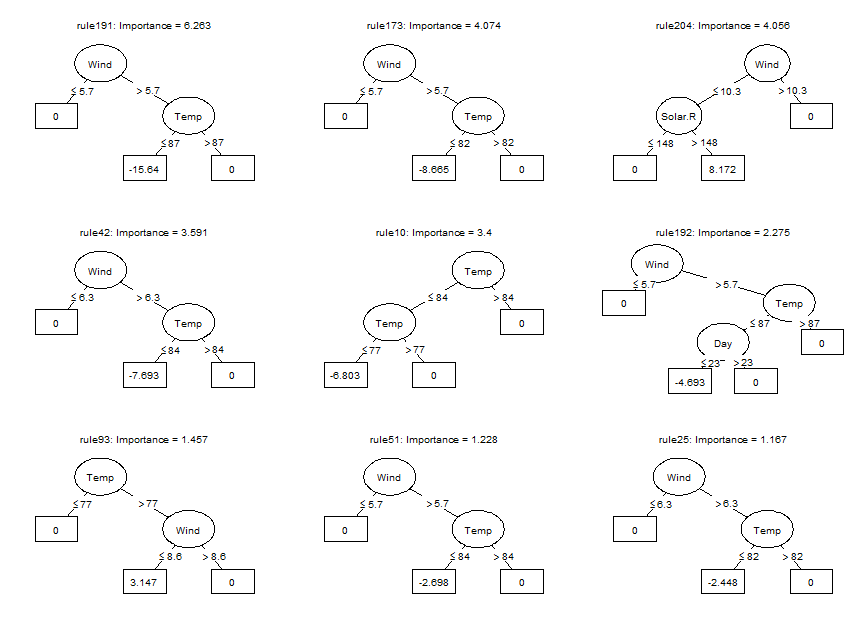
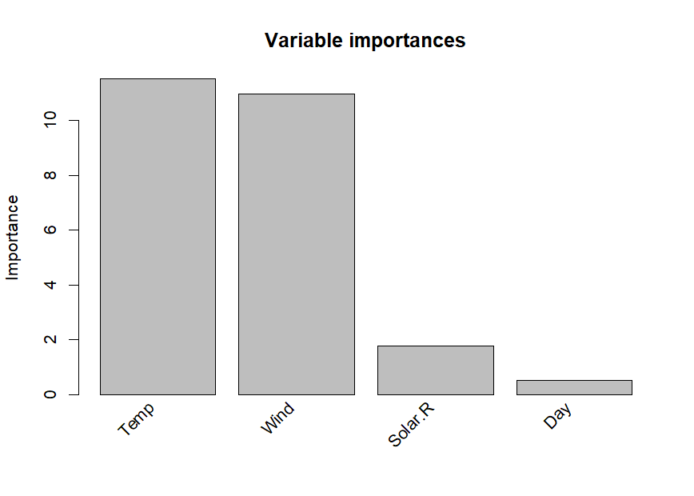
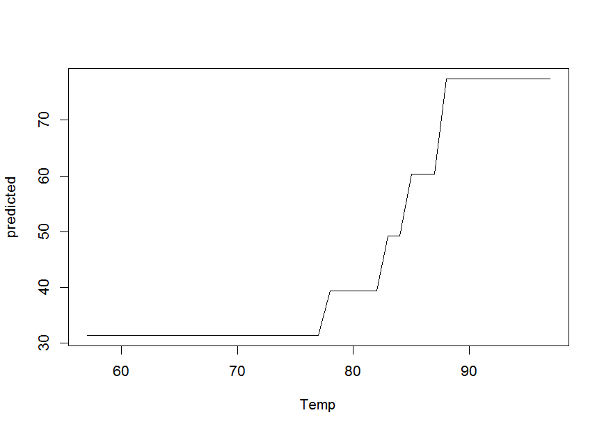
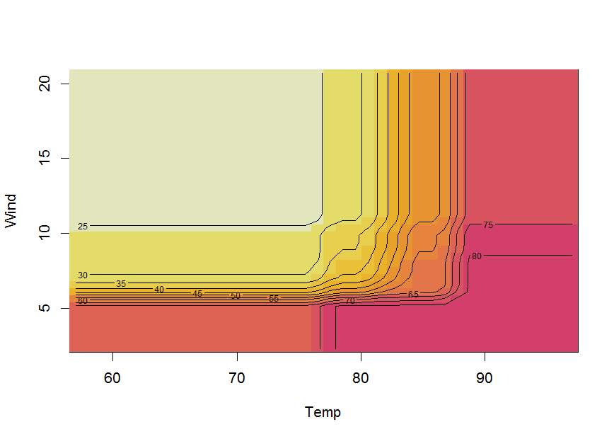
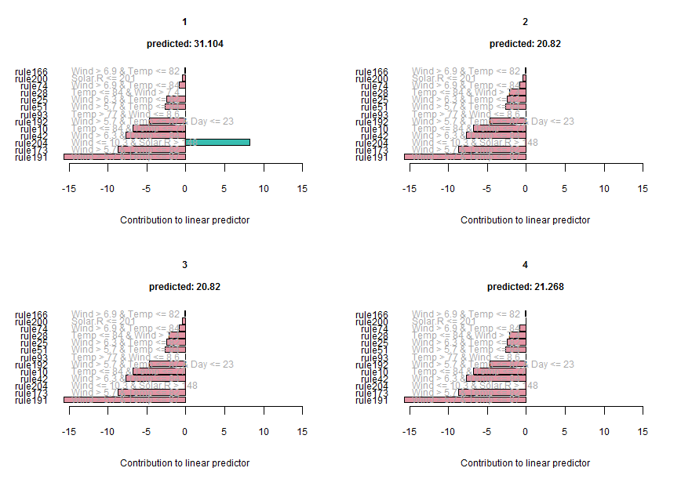
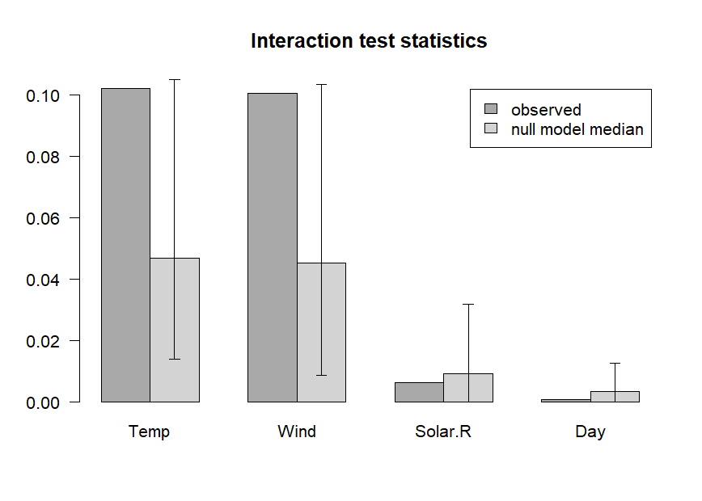
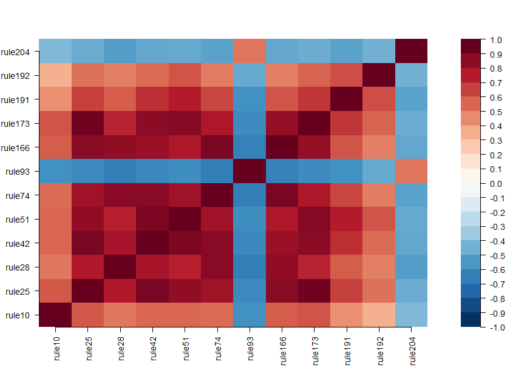

pre: an R package for deriving prediction rule ensembles
========================================================

**pre** is an **R** package for deriving prediction rule ensembles for binary, multinomial, (multivariate) continuous, count and survival outcome variables. Input variables may be numeric, ordinal and categorical. An extensive description of the implementation and functionality is provided in Fokkema (2017). The package largely implements the algorithm for deriving prediction rule ensembles as described in Friedman & Popescu (2008), with several adjustments:

1.  The package is completely R based, allowing users better access to the results and more control over the parameters used for generating the prediction rule ensemble.
2.  The unbiased tree induction algorithms of Hothorn, Hornik, & Zeileis (2006) is used for deriving prediction rules, by default. Alternatively, the (g)lmtree algorithm of Zeileis, Hothorn, & Hornik (2008) can be employed, or the classification and regression tree (CART) algorithm of Breiman, Friedman, Olshen, & Stone (1984).
3.  The package supports a wider range of response variable types.
4.  The package allows for plotting the final rule ensemble as a collection of simple decision trees.
5.  The initial ensembles may be generated as in bagging, boosting and/or random forests.
6.  Hinge functions of predictor variables may be included as baselearners, like in the multivariate adaptive regression splines method of Friedman (1991), using function `gpe()`.

Note that pre is under development, and much work still needs to be done. Below, a short introductory example is provided. Fokkema (2017) provides an extensive description of the fitting procedures implemented in function `pre()` and example analyses with more extensive explanations.

Example: Prediction rule ensemble for predicting ozone levels
-------------------------------------------------------------

To get a first impression of how function `pre()` works, we will fit a prediction rule ensemble to predict Ozone levels using the `airquality` dataset. We can fit a prediction rule ensemble using the `pre()` function:

``` r
library("pre")
airq <- airquality[complete.cases(airquality), ]
set.seed(42)
airq.ens <- pre(Ozone ~ ., data = airq)
```

We can print the resulting ensemble (alternatively, we could use the `print` method):

``` r
airq.ens
#> 
#> Final ensemble with cv error within 1se of minimum: 
#>   lambda =  2.331694
#>   number of terms = 13
#>   mean cv error (se) = 302.4644 (79.28454)
#> 
#>   cv error type : Mean-Squared Error
#> 
#>          rule  coefficient                          description
#>   (Intercept)   72.9680699                                    1
#>       rule191  -15.6401487              Wind > 5.7 & Temp <= 87
#>       rule173   -8.6645924              Wind > 5.7 & Temp <= 82
#>       rule204    8.1715564         Wind <= 10.3 & Solar.R > 148
#>        rule42   -7.6928586              Wind > 6.3 & Temp <= 84
#>        rule10   -6.8032890              Temp <= 84 & Temp <= 77
#>       rule192   -4.6926624  Wind > 5.7 & Temp <= 87 & Day <= 23
#>        rule93    3.1468762              Temp > 77 & Wind <= 8.6
#>        rule51   -2.6981570              Wind > 5.7 & Temp <= 84
#>        rule25   -2.4481192              Wind > 6.3 & Temp <= 82
#>        rule28   -2.1119330              Temp <= 84 & Wind > 7.4
#>        rule74   -0.8276940              Wind > 6.9 & Temp <= 84
#>       rule200   -0.4479854                       Solar.R <= 201
#>       rule166   -0.1202175              Wind > 6.9 & Temp <= 82
```

Note that the cross-validated error printed here is calculated using the same data as was used for generating the rules and therefore may provide an overly optimistic estimate of future prediction error. To obtain a more realistic prediction error estimate, we will use function `cvpre()` later on. If linear terms were selected for the final ensemble (which is not the case here), the winsorizing points used to reduce the influence of outliers on the estimated coefficient are provided in the `description` column.

We can plot the baselearners in the ensemble using the `plot` method. Note that only the nine most important baselearners are requested here through specification of the `nterms` argument. Through using the `cex` argument, we specify the size of the node and path labels. Also note that plotting the baselearners provides the exact same information as printing the ensemble as above, but now in decision tree format:

``` r
plot(airq.ens, nterms = 9, cex = .5)
```



We can obtain the estimated coefficients for each of the baselearners using the `coef` method:

``` r
coefs <- coef(airq.ens)
coefs[1:10,]
#>            rule coefficient                         description
#> 201 (Intercept)   72.968070                                   1
#> 167     rule191  -15.640149             Wind > 5.7 & Temp <= 87
#> 150     rule173   -8.664592             Wind > 5.7 & Temp <= 82
#> 179     rule204    8.171556        Wind <= 10.3 & Solar.R > 148
#> 39       rule42   -7.692859             Wind > 6.3 & Temp <= 84
#> 10       rule10   -6.803289             Temp <= 84 & Temp <= 77
#> 168     rule192   -4.692662 Wind > 5.7 & Temp <= 87 & Day <= 23
#> 84       rule93    3.146876             Temp > 77 & Wind <= 8.6
#> 48       rule51   -2.698157             Wind > 5.7 & Temp <= 84
#> 23       rule25   -2.448119             Wind > 6.3 & Temp <= 82
```

We can assess the importance of input variables as well as baselearners using the `importance()` function:

``` r
imps <- importance(airq.ens, round = 4)
```



The resulting plot shows that Temperature and wind are most strongly associated with Ozone levels, while Solar.R and Day are somewhat, but much less strongly, associated with Ozone levels. Variable Month is not included in the plotted variable importances, indicating that is not associate with Ozone levels. The variable and baselearner importances are saved in `imps$varimps` and `imps$baseimps`, respectively.

We can generate predictions for new observations using the `predict` method:

``` r
predict(airq.ens, newdata = airq[1:4, ])
#>        1        2        3        4 
#> 31.10390 20.82041 20.82041 21.26840
```

We can obtain partial dependence plots to assess the effect of single predictor variables on the outcome using the `singleplot()` function:

``` r
singleplot(airq.ens, varname = "Temp")
```



We can obtain partial dependence plots to assess the effects of pairs of predictor variables on the outcome using the `pairplot()` function:

``` r
pairplot(airq.ens, varnames = c("Temp", "Wind"))
```



Note that plotting partial dependence is computationally intensive and computation time will increase fast with increasing numbers of observations and numbers of variables. `R` package `plotmo` created by Stephen Milborrow (2018) provides more efficient functions for plotting partial dependence, which also support `pre` models.

If the final ensemble does not contain a lot of terms, inspecting individual rules and linear terms through the `print` method may be (much) more informative than partial dependence plots. One of the main advantages of prediction rule ensembles is their interpretability: the predictive model contains only simple functions of the predictor variables (rules and linear terms), which are easy to grasp. Partial dependence plots are often useful for interpretation of more complex models, like random forests for example.

We can obtain explanations of the predictions for individual observations using function `explain()`:

``` r
expl <- explain(airq.ens, newdata = airq[1:4, ], cex = .7)
```



The values of the rules and linear terms for each observations are saved in `expl$predictors` and the contributions in `expl$contribution`.

We can assess the expected prediction error of the prediction rule ensemble through cross validation (10-fold, by default) using the `cvpre()` function:

``` r
set.seed(43)
airq.cv <- cvpre(airq.ens)
#> $MSE
#>       MSE        se 
#> 332.48191  72.23573 
#> 
#> $MAE
#>       MAE        se 
#> 13.186533  1.200747
```

The results provide the mean squared error (MSE) and mean absolute error (MAE) with their respective standard errors. The cross-validated predictions, which can be used to compute alternative estimates of predictive accuracy, are saved in `airq.cv$cvpreds`. The folds to which observations were assigned as saved in `airq.cv$fold_indicators`.

We can assess the presence of input variable interactions using the `interact()` and `bsnullinteract()` funtions. Function `bsnullinteract()` computes null-interaction models (10, by default) based on bootstrap-sampled and permuted datasets. Function `interact()` computes interaction test statistics for each predictor variables appearing in the specified ensemble. If null-interaction models are provided through the `nullmods` argument, interaction test statistics will also be computed for the null-interaction model, providing a reference null distribution.

``` r
set.seed(44)
nullmods <- bsnullinteract(airq.ens)
int <- interact(airq.ens, nullmods = nullmods)
```



The plot with variable interaction strengths indicates that Temperature and Wind may be involved in interactions, as their observed interaction strengths (darker grey) exceed the upper limit of the 90% confidence interval (CI) of interaction stengths in the null interaction models (lighter grey bar represents the median, error bars represent the 90% CIs). The plot indicates that Solar.R and Day are not involved in any interactions. Note that computation of null interaction models is computationally intensive. A more reliable result can be obtained by computing a larger number of boostrapped null interaction datasets, by setting the `nsamp` argument of function `bsnullinteract()` to a larger value (e.g., 100).

Finally, we can assess correlations between the baselearners appearing in the ensemble using the `corplot()` function:

``` r
corplot(airq.ens)
```



Including hinge functions (multivariate adaptive regression splines)
--------------------------------------------------------------------

More complex prediction ensembles can be obtained using the `gpe()` function. Abbreviation gpe stands for generalized prediction ensembles, which can also include hinge functions of the predictor variables as described in Friedman (1991), in addition to rules and/or linear terms. Addition of hinge functions may further improve predictive accuracy. See the following example:

``` r
set.seed(42)
airq.gpe <- gpe(Ozone ~ ., data = airquality[complete.cases(airquality),], 
    base_learners = list(gpe_trees(), gpe_linear(), gpe_earth()))
airq.gpe
#> 
#> Final ensemble with cv error within 1se of minimum: 
#>   lambda =  2.44272
#>   number of terms = 14
#>   mean cv error (se) = 296.5474 (74.18922)
#> 
#>   cv error type : Mean-squared Error
#> 
#>                                   description  coefficient
#>                                   (Intercept)  67.22404190
#>                                    Temp <= 77  -7.72729559
#>                       Temp <= 84 & Wind > 7.4  -0.03574864
#>                  Wind <= 10.3 & Solar.R > 148   6.29678603
#>                       Wind > 5.7 & Temp <= 82  -6.51245200
#>                       Wind > 5.7 & Temp <= 84  -7.58076900
#>                       Wind > 5.7 & Temp <= 87  -9.64346611
#>           Wind > 5.7 & Temp <= 87 & Day <= 23  -4.38371322
#>                       Wind > 6.3 & Temp <= 82  -4.18790433
#>                       Wind > 6.3 & Temp <= 84  -4.88269073
#>                       Wind > 6.9 & Temp <= 82  -0.12188611
#>                       Wind > 6.9 & Temp <= 84  -0.93529314
#>   eTerm(Solar.R * h(6.3 - Wind), scale = 150)   1.42794086
#>        eTerm(h(6.9 - Wind) * Day, scale = 16)   1.35764132
#>   eTerm(Solar.R * h(9.7 - Wind), scale = 410)   9.84395780
#> 
#>   'h' in the 'eTerm' indicates the hinge function
```

References
----------

Breiman, L., Friedman, J., Olshen, R., & Stone, C. (1984). Classification and regression trees. Chapman&Hall/CRC.

Fokkema, M. (2017). Pre: An R package for fitting prediction rule ensembles. *arXiv:1707.07149*. Retrieved from <https://arxiv.org/abs/1707.07149>

Friedman, J. (1991). Multivariate adaptive regression splines. *The Annals of Statistics*, *19*(1), 1–67.

Friedman, J., & Popescu, B. (2008). Predictive learning via rule ensembles. *The Annals of Applied Statistics*, *2*(3), 916–954. Retrieved from <http://www.jstor.org/stable/30245114>

Hothorn, T., Hornik, K., & Zeileis, A. (2006). Unbiased recursive partitioning: A conditional inference framework. *Journal of Computational and Graphical Statistics*, *15*(3), 651–674.

Milborrow, S. (2018). *Plotmo: Plot a model’s residuals, response, and partial dependence plots*. Retrieved from <https://CRAN.R-project.org/package=plotmo>

Zeileis, A., Hothorn, T., & Hornik, K. (2008). Model-based recursive partitioning. *Journal of Computational and Graphical Statistics*, *17*(2), 492–514.
