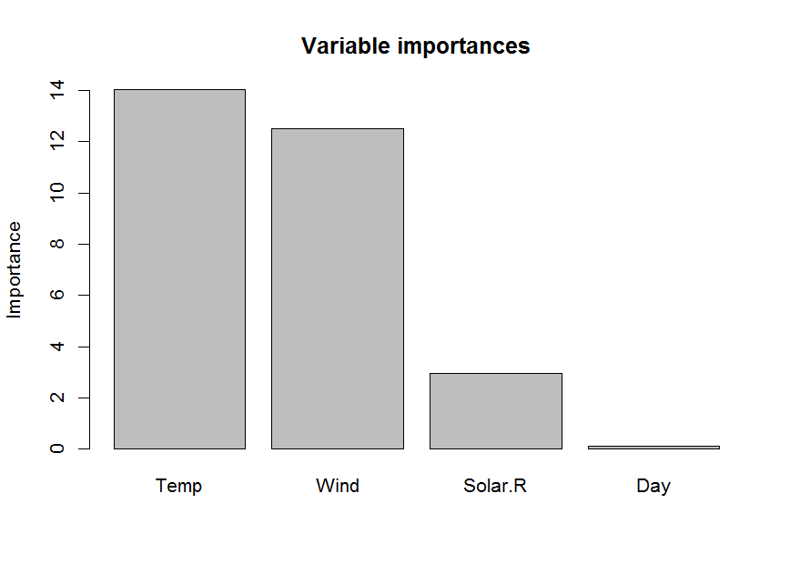
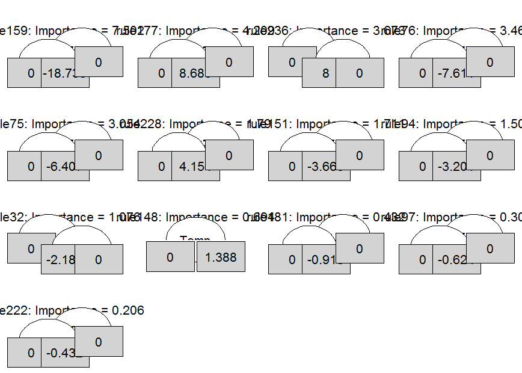
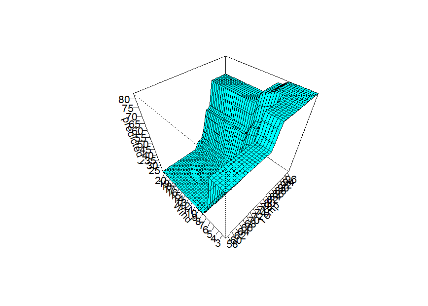
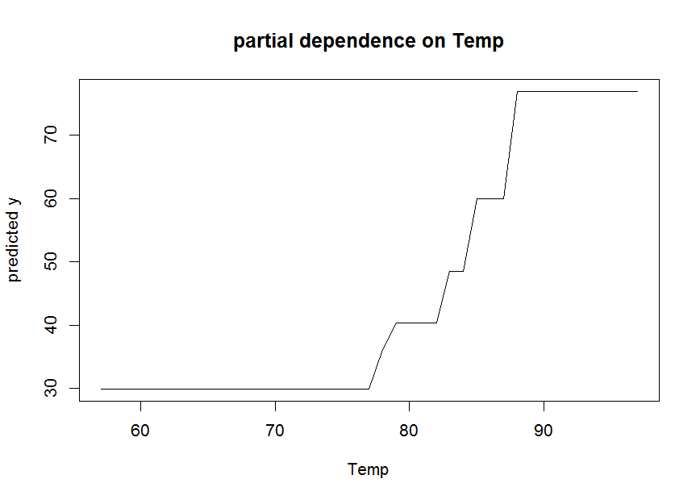
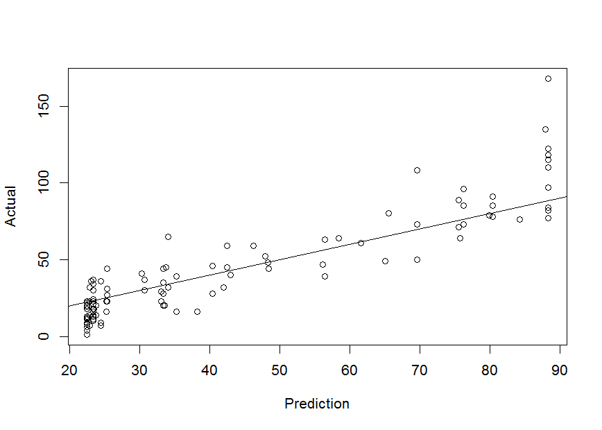
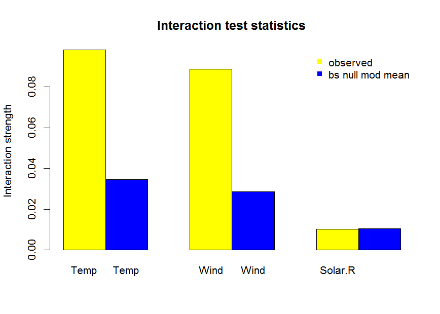

pre is an R package for deriving prediction rule ensembles for binary and continuous outcome variables. Input variables may be numeric, ordinal and nominal. The package implements the algorithm for deriving prediction rule ensembles as described in (Friedman and Popescu 2008), with some improvements and adjustments. The most important improvements and adjustments are:

1.  The pre package is completely R based, allowing users better access to the results and more control over the parameters used for generating the prediction rule ensemble
2.  An unbiased tree induction algorithm is used for deriving prediction rules. Friedman & Popescu used the classification and regression tree (CART) algorithm, but this suffers from biased variable selection.
3.  The package allows for plotting the final rule ensemble as a collection of simple decision trees.
4.  The initial ensemble of prediction rules can be generated as a bagged, boosted and/or random forest ensemble.

The pre package is developed to provide useRs a completely R based implementation of the algorithm described by (Friedman and Popescu 2008). However, note that pre is under development, and much work still needs to be done. See (Fokkema et al. 2015) for an application of the methods.

Examples
========

To get a first impression of how pre works, consider the following example of prediction rule ensemble, using the airquality dataset:

``` r
library(pre)
#> Loading required package: partykit
#> Loading required package: grid
is_complete <- complete.cases(airquality)
airq.ens <- pre(Ozone ~ ., data = airquality[is_complete, ], verbose = TRUE)
#> A rule ensemble for prediction of a continuous output variable will 
#>           be created.
#> 
#> A total of 500 trees and  897 rules were 
#>           generated initially.
#> 
#> A total of 627 rules were empty
#>             and removed from the initial ensemble.
#> 
#> A total of 25 generated rules had 
#>               support identical to earlier rules and were removed from the initial 
#>               ensemble ($duplicates.removed shows which, if any).
#> 
#> A total of 2 generated rules had 
#>              support that was the complement of the support of earlier rules and were removed from the initial 
#>              ensemble ($complements.removed shows which, if any).
#> 
#> An initial ensemble consisting of 212 rules was 
#>             succesfully created.
#> 
#> Final ensemble with minimum cv error: 
#>   lambda = 0.2619248
#>   number of terms = 32
#>   mean cv error (se) = 230.1749 (47.43908)
#> 
#> Final ensemble with cv error within 1se of minimum: 
#>   lambda = 2.331694
#>   number of terms = 13
#>   mean cv error (se) = 275.0646 (63.91246)
print(airq.ens, penalty.par.val = "lambda.1se")
#> 
#> Final ensemble with cv error within 1se of minimum: 
#>   lambda =  2.331694
#>   number of terms = 13
#>   mean cv error (se) = 275.0646 (63.91246) 
#> 
#>          rule  coefficient                  description
#>   (Intercept)   66.1819328                         <NA>
#>       rule159  -18.7350689      Wind > 5.7 & Temp <= 87
#>       rule177    8.6825348      Temp > 77 & Wind <= 9.7
#>       rule236    8.0001231    Solar.R > 201 & Temp > 78
#>        rule76   -7.6105386      Wind > 5.7 & Temp <= 84
#>        rule75   -6.4070400      Wind > 6.3 & Temp <= 82
#>       rule228    4.1535959    Solar.R > 183 & Wind <= 8
#>       rule151   -3.6663981      Wind > 6.3 & Temp <= 84
#>        rule94   -3.2009607      Wind > 5.7 & Temp <= 82
#>        rule32   -2.1825758      Temp <= 84 & Wind > 7.4
#>       rule148    1.3876383                    Temp > 77
#>       rule181   -0.9183333  Wind > 6.3 & Solar.R <= 149
#>        rule97   -0.6241135        Wind > 8 & Temp <= 77
#>       rule222   -0.4324227       Temp <= 87 & Day <= 23
print(airq.ens, penalty.par.val = "lambda.min")
#> Final ensemble with minimum cv error: 
#> 
#>   lambda =  0.2619248
#>   number of terms = 32
#>   mean cv error (se) = 230.1749 (47.43908) 
#> 
#>          rule  coefficient                               description
#>   (Intercept)   68.1965705                                      <NA>
#>       rule159  -25.6007284                   Wind > 5.7 & Temp <= 87
#>       rule236   12.9831333                 Solar.R > 201 & Temp > 78
#>       rule119    9.7203286                   Temp > 78 & Wind <= 4.6
#>       rule179   -9.5825496  Wind > 6.3 & Temp <= 84 & Solar.R <= 149
#>       rule228    7.6258668                 Solar.R > 183 & Wind <= 8
#>       rule244   -6.8867967                Wind > 5.7 & Solar.R > 175
#>       rule100    6.7523806                 Temp <= 86 & Solar.R > 81
#>        rule76   -6.5100276                   Wind > 5.7 & Temp <= 84
#>       rule132    6.0515318                    Temp <= 85 & Temp > 77
#>       rule204   -6.0197680   Wind > 5.7 & Temp <= 84 & Solar.R > 175
#>        rule75   -5.7139408                   Wind > 6.3 & Temp <= 82
#>        rule27   -5.7033923       Temp > 78 & Wind > 6.3 & Temp <= 83
#>       rule222   -5.2806402                    Temp <= 87 & Day <= 23
#>        rule70    4.9960160        Temp <= 87 & Temp > 77 & Month > 7
#>       rule156    4.5478997                      Temp > 77 & Day > 20
#>       rule173    4.1710432                   Wind <= 9.2 & Temp > 88
#>       rule153    2.7945838       Temp <= 84 & Temp > 65 & Month <= 8
#>       rule211   -2.5940565                               Wind > 10.3
#>       rule231    2.2132736                             Solar.R > 220
#>        rule15    2.2112710                  Temp <= 82 & Wind <= 7.4
#>       rule177    2.2006028                   Temp > 77 & Wind <= 9.7
#>       rule232   -2.1715789                      Wind > 8 & Day <= 14
#>        rule55    1.8442578                   Temp > 77 & Wind <= 6.9
#>        rule36    1.7077629                    Wind > 6.3 & Temp > 82
#>       rule252    1.5844797    Wind > 6.9 & Day <= 21 & Solar.R > 149
#>       rule265   -1.3420526               Wind > 6.9 & Solar.R <= 149
#>       rule151   -1.3252358                   Wind > 6.3 & Temp <= 84
#>        rule79    0.8945285                    Wind > 6.3 & Temp > 84
#>       rule154   -0.3764326        Temp <= 84 & Temp > 65 & Month > 8
#>       rule149   -0.1310046                Temp <= 83 & Solar.R <= 49
#>        rule94   -0.0383628                   Wind > 5.7 & Temp <= 82
#>       rule223    0.0224742                     Temp <= 87 & Day > 23
```

``` r
# Let's take the smallest ensemble yielding a cross-validated error within 1se 
# of the minimum (this is the default in all pre functions): 

# Inspect the prediction rule ensemble:
head(coef(airq.ens), 10)
#>            rule coefficient               description
#> 1   (Intercept)   66.181933                      <NA>
#> 61      rule159  -18.735069   Wind > 5.7 & Temp <= 87
#> 79      rule177    8.682535   Temp > 77 & Wind <= 9.7
#> 130     rule236    8.000123 Solar.R > 201 & Temp > 78
#> 196      rule76   -7.610539   Wind > 5.7 & Temp <= 84
#> 195      rule75   -6.407040   Wind > 6.3 & Temp <= 82
#> 122     rule228    4.153596 Solar.R > 183 & Wind <= 8
#> 53      rule151   -3.666398   Wind > 6.3 & Temp <= 84
#> 212      rule94   -3.200961   Wind > 5.7 & Temp <= 82
#> 160      rule32   -2.182576   Temp <= 84 & Wind > 7.4
importance(airq.ens)
```



    #> $varimps
    #>   varname        imp
    #> 3    Temp 14.0460883
    #> 2    Wind 12.5238961
    #> 1 Solar.R  2.9475865
    #> 5     Day  0.1030562
    #> 
    #> $baseimps
    #>        rule                 description       imp coefficient        sd
    #> 61  rule159     Wind > 5.7 & Temp <= 87 7.5024620 -18.7350689 0.4004502
    #> 79  rule177     Temp > 77 & Wind <= 9.7 4.2094916   8.6825348 0.4848229
    #> 130 rule236   Solar.R > 201 & Temp > 78 3.6731876   8.0001231 0.4591414
    #> 196  rule76     Wind > 5.7 & Temp <= 84 3.4629490  -7.6105386 0.4550202
    #> 195  rule75     Wind > 6.3 & Temp <= 82 3.0538861  -6.4070400 0.4766454
    #> 122 rule228   Solar.R > 183 & Wind <= 8 1.7901439   4.1535959 0.4309865
    #> 53  rule151     Wind > 6.3 & Temp <= 84 1.7112860  -3.6663981 0.4667486
    #> 212  rule94     Wind > 5.7 & Temp <= 82 1.5052353  -3.2009607 0.4702449
    #> 160  rule32     Temp <= 84 & Wind > 7.4 1.0764398  -2.1825758 0.4931970
    #> 49  rule148                   Temp > 77 0.6935350   1.3876383 0.4997952
    #> 84  rule181 Wind > 6.3 & Solar.R <= 149 0.4318415  -0.9183333 0.4702449
    #> 214  rule97       Wind > 8 & Temp <= 77 0.3040569  -0.6241135 0.4871821
    #> 117 rule222      Temp <= 87 & Day <= 23 0.2061123  -0.4324227 0.4766454
    plot(airq.ens)



``` r
pairplot(airq.ens, varnames = c("Temp", "Wind"))
```



    #> NOTE: function pairplot uses package 'akima', which has an ACM license.
    #>     See also https://www.acm.org/publications/policies/software-copyright-notice.
    singleplot(airq.ens, varname = "Temp")



``` r
# Generate predictions:
airq.preds <- predict(airq.ens)
plot(airq.preds, airquality$Ozone[is_complete], 
     xlab = "Prediction", ylab = "Actual")
abline(a = 0, b = 1)
```



``` r
# Calculate 10-fold cross-validated error:
airq.cv <- cvpre(airq.ens)
airq.cv$accuracy
#> $MSE
#> [1] 403.8556
#> 
#> $MAE
#> [1] 13.96879
```

``` r
# Assess interaction effects of predictor variables:
nullmods <- bsnullinteract(airq.ens, verbose = FALSE)
interact(airq.ens, varnames = c("Temp", "Wind", "Solar.R"), nullmods = nullmods)
```



    #> $trainingH2
    #>       Temp       Wind    Solar.R 
    #> 0.09826132 0.08878277 0.01023634 
    #> 
    #> $nullH2
    #>           Temp        Wind     Solar.R
    #> 1  0.019426386 0.017590994 0.010694943
    #> 2  0.047977017 0.027193054 0.026175323
    #> 3  0.040478410 0.030282946 0.010451812
    #> 4  0.037267634 0.027313284 0.004189972
    #> 5  0.045316708 0.033326270 0.011828865
    #> 6  0.035542079 0.035542079 0.000000000
    #> 7  0.054408881 0.038205286 0.027066122
    #> 8  0.029773369 0.029773369 0.000000000
    #> 9  0.026577596 0.036995759 0.006435320
    #> 10 0.009112392 0.009359814 0.007706163

References
==========

Fokkema, Marjolein, Niels Smits, Henk Kelderman, and Brenda WJH Penninx. 2015. “Connecting Clinical and Actuarial Prediction with Rule-Based Methods.” *Psychological Assessment* 27 (2). American Psychological Association: 636.

Friedman, Jerome H., and Bogdan E. Popescu. 2008. “Predictive Learning via Rule Ensembles.” *The Annals of Applied Statistics* 2 (3). Institute of Mathematical Statistics: 916–54. <http://www.jstor.org/stable/30245114>.
