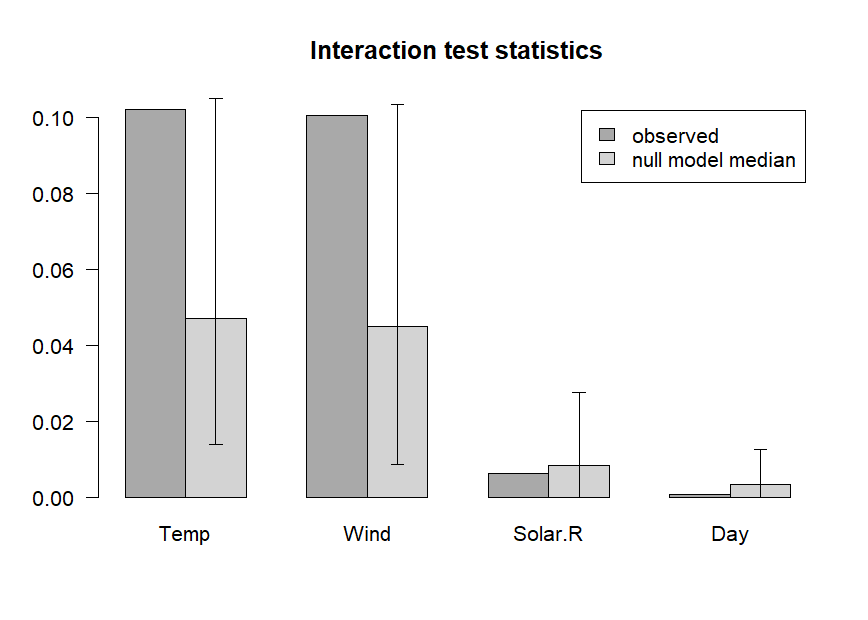

pre: an R package for deriving prediction rule ensembles
========================================================

**pre** is an **R** package for deriving prediction rule ensembles for
binary, multinomial, (multivariate) continuous, count and survival
responses. Input variables may be numeric, ordinal and categorical. An
extensive description of the implementation and functionality is
provided in Fokkema (2020), an extensive introduction aimed at social scientists is provided in Fokkema & Strobl (2020). The package largely implements the algorithm
for deriving prediction rule ensembles as described in Friedman &
Popescu (2008), with several adjustments:

1.  The package is completely **R** based, allowing users better access
    to the results and more control over the parameters used for
    generating the prediction rule ensemble.
2.  The unbiased tree induction algorithms of Hothorn, Hornik, &
    Zeileis (2006) is used for deriving prediction rules, by default.
    Alternatively, the (g)lmtree algorithm of Zeileis, Hothorn, &
    Hornik (2008) can be employed, or the classification and regression
    tree (CART) algorithm of Breiman, Friedman, Olshen, & Stone (1984).
3.  The package supports a wider range of response variable types.
4.  The initial ensembles may be generated as in bagging, boosting
    and/or random forests.
5.  Hinge functions of predictor variables may be included as
    baselearners, as in the multivariate adaptive regression splines
    method of Friedman (1991), using function `gpe()`.

Note that **pre** is under development, and much work still needs to be
done. Below, a short introductory example is provided. Fokkema (2017)
provides an extensive description of the fitting procedures implemented
in function `pre()` and example analyses with more extensive
explanations.

Example: Predicting ozone levels
--------------------------------

To get a first impression of how function `pre()` works, we will fit a
prediction rule ensemble to predict Ozone levels using the `airquality`
dataset. We fit a prediction rule ensemble using function `pre()`:

``` r
library("pre")
airq <- airquality[complete.cases(airquality), ]
set.seed(42)
airq.ens <- pre(Ozone ~ ., data = airq)
```

Note that it is necessary to set the random seed, to allow for later
replication of the results, because the fitting procedure depends on
random sampling of training observations.

We can print the resulting ensemble (alternatively, we could use the
`print` method):

``` r
airq.ens
#> 
#> Final ensemble with cv error within 1se of minimum: 
#>   lambda =  3.543968
#>   number of terms = 12
#>   mean cv error (se) = 352.3834 (99.13981)
#> 
#>   cv error type : Mean-Squared Error
#> 
#>          rule   coefficient                          description
#>   (Intercept)   68.48270406                                    1
#>       rule191  -10.97368179              Wind > 5.7 & Temp <= 87
#>       rule173  -10.90385520              Wind > 5.7 & Temp <= 82
#>        rule42   -8.79715538              Wind > 6.3 & Temp <= 84
#>       rule204    7.16114780         Wind <= 10.3 & Solar.R > 148
#>        rule10   -4.68646144              Temp <= 84 & Temp <= 77
#>       rule192   -3.34460037  Wind > 5.7 & Temp <= 87 & Day <= 23
#>        rule51   -2.27864287              Wind > 5.7 & Temp <= 84
#>        rule93    2.18465676              Temp > 77 & Wind <= 8.6
#>        rule74   -1.36479546              Wind > 6.9 & Temp <= 84
#>        rule28   -1.15326093              Temp <= 84 & Wind > 7.4
#>        rule25   -0.70818399              Wind > 6.3 & Temp <= 82
#>       rule166   -0.04751152              Wind > 6.9 & Temp <= 82
```

The firest few lines of the printed results provide the penalty
parameter value (*λ*) employed for selecting the final ensemble. By
default, the ‘1-SE’ rule is used for selecting *λ*; this default can be
overridden by employing the `penalty.par.val` argument of the `print`
method and other functions in the package. Note that the printed
cross-validated error is calculated using the same data as was used for
generating the rules and likely provides an overly optimistic estimate
of future prediction error. To obtain a more realistic prediction error
estimate, we will use function `cvpre()` later on.

Next, the printed results provide the rules and linear terms selected in
the final ensemble, with their estimated coefficients. For rules, the
`description` column provides the conditions. For linear terms (which
were not selected in the current ensemble), the winsorizing points used
to reduce the influence of outliers on the estimated coefficient would
be printed in the `description` column. The `coefficient` column
presents the estimated coefficient. These are regression coefficients,
reflecting the expected increase in the response for a unit increase in
the predictor, keeping all other predictors constant. For rules, the
coefficient thus reflects the difference in the expected value of the
response when the conditions of the rule are met, compared to when they
are not.

Using the `plot` method, we can plot the rules in the ensemble as simple
decision trees. Here, we will request the nine most important
baselearners through specification of the `nterms` argument. Through the
`cex` argument, we specify the size of the node and path labels:

``` r
plot(airq.ens, nterms = 9, cex = .5)
```


Using the `coef` method, we can obtain the estimated coefficients for
each of the baselearners (we only print the first six terms here for
space considerations):

``` r
coefs <- coef(airq.ens)
coefs[1:6, ]
#>            rule coefficient                  description
#> 201 (Intercept)   68.482704                            1
#> 167     rule191  -10.973682      Wind > 5.7 & Temp <= 87
#> 150     rule173  -10.903855      Wind > 5.7 & Temp <= 82
#> 39       rule42   -8.797155      Wind > 6.3 & Temp <= 84
#> 179     rule204    7.161148 Wind <= 10.3 & Solar.R > 148
#> 10       rule10   -4.686461      Temp <= 84 & Temp <= 77
```

We can generate predictions for new observations using the `predict`
method (only the first six predicted values are printed here for space
considerations):

``` r
predict(airq.ens, newdata = airq[1:6, ])
#>        1        2        3        4        7        8 
#> 32.53896 24.22456 24.22456 24.22456 31.38570 24.22456
```

Using function `cvpre()`, we can assess the expected prediction error of
the fitted PRE through *k*-fold cross validation (*k* = 10, by default,
which can be overridden through specification of the `k` argument):

``` r
set.seed(43)
airq.cv <- cvpre(airq.ens)
#> $MSE
#>      MSE       se 
#> 369.2010  88.7574 
#> 
#> $MAE
#>      MAE       se 
#> 13.64524  1.28985
```

The results provide the mean squared error (MSE) and mean absolute error
(MAE) with their respective standard errors. These results are saved for
later use in `aiq.cv$accuracy`. The cross-validated predictions, which
can be used to compute alternative estimates of predictive accuracy, are
saved in `airq.cv$cvpreds`. The folds to which observations were
assigned are saved in `airq.cv$fold_indicators`.

Tools for interpretation
------------------------

Package **pre** provides several additional tools for interpretation of
the final ensemble. These may be especially helpful for complex
ensembles containing many rules and linear terms.

### Importance measures

We can assess the relative importance of input variables as well as
baselearners using the `importance()` function:

``` r
imps <- importance(airq.ens, round = 4)
```


As we already observed in the printed ensemble, the plotted variable
importances indicate that Temperature and Wind are most strongly
associated with Ozone levels. Solar.R and Day are also associated with
Ozone levels, but much less strongly. Variable Month is not plotted,
which means it obtained an importance of zero, indicating that it is not
associated with Ozone levels. We already observed this in the printed
ensemble: Month did not appear in any of the selected terms. The
variable and baselearner importances are saved for later use in
`imps$varimps` and `imps$baseimps`, respectively.

### Explaining individual predictions

We can obtain explanations of the predictions for individual
observations using function `explain()`:

``` r
par(mfrow = c(1, 2))
expl <- explain(airq.ens, newdata = airq[1:2, ], cex = .8)
```


The values of the rules and linear terms for each observation are saved
in `expl$predictors`, their contributions in `expl$contribution` and the
predicted values in `expl$predicted.value`.

### Partial dependence plots

We can obtain partial dependence plots to assess the effect of single
predictor variables on the outcome using the `singleplot()` function:

``` r
singleplot(airq.ens, varname = "Temp")
```


We can obtain partial dependence plots to assess the effects of pairs of
predictor variables on the outcome using the `pairplot()` function:

``` r
pairplot(airq.ens, varnames = c("Temp", "Wind"))
```


Note that creating partial dependence plots is computationally intensive
and computation time will increase fast with increasing numbers of
observations and numbers of variables. `**R**` package `**plotmo**`
(Milborrow (2018)) provides more efficient functions for plotting
partial dependence, which also support `pre` models.

If the final ensemble does not contain many terms, inspecting individual
rules and linear terms through the `print` method may be more
informative than partial dependence plots. One of the main advantages of
prediction rule ensembles is their interpretability: the predictive
model contains only simple functions of the predictor variables (rules
and linear terms), which are easy to grasp. Partial dependence plots are
often much more useful for interpretation of complex models, like random
forests for example.

### Assessing presence of interactions

We can assess the presence of interactions between the input variables
using the `interact()` and `bsnullinteract()` funtions. Function
`bsnullinteract()` computes null-interaction models (10, by default)
based on bootstrap-sampled and permuted datasets. Function `interact()`
computes interaction test statistics for each predictor variables
appearing in the specified ensemble. If null-interaction models are
provided through the `nullmods` argument, interaction test statistics
will also be computed for the null-interaction model, providing a
reference null distribution.

Note that computing null interaction models and interaction test
statistics is computationally very intensive, so running the following
code will take some time:

``` r
set.seed(44)
nullmods <- bsnullinteract(airq.ens)
int <- interact(airq.ens, nullmods = nullmods)
```



The plotted variable interaction strengths indicate that Temperature and
Wind may be involved in interactions, as their observed interaction
strengths (darker grey) exceed the upper limit of the 90% confidence
interval (CI) of interaction stengths in the null interaction models
(lighter grey bar represents the median, error bars represent the 90%
CIs). The plot indicates that Solar.R and Day are not involved in any
interactions. Note that computation of null interaction models is
computationally intensive. A more reliable result can be obtained by
computing a larger number of boostrapped null interaction datasets, by
setting the `nsamp` argument of function `bsnullinteract()` to a larger
value (e.g., 100).

### Correlations between selected terms

We can assess correlations between the baselearners appearing in the
ensemble using the `corplot()` function:

``` r
corplot(airq.ens)
```


Tuning parameters
-----------------

To obtain an optimal set of model-fitting parameters, function `train()`
from package **`caret`** Kuhn (2008) can be employed. Package **`pre`**
supports this through the `caret_pre_model` object (see also
`?caret_pre_model`). Note that it’s best to specify the `x` and `y`
arguments when using function `train()` to train the parameters of
`pre()`; the use of the `formula` and `data` arguments may lead to
unexpected results.

``` r
## Load library
library("caret")
#> Loading required package: lattice
#> Loading required package: ggplot2
## Prepare data
airq <- airquality[complete.cases(airquality),]
y <- airq$Ozone
x <- airq[,-1]
```

The following parameters can be tuned:

``` r
caret_pre_model$parameters
#>         parameter     class                          label
#> 1        sampfrac   numeric           Subsampling Fraction
#> 2        maxdepth   numeric                 Max Tree Depth
#> 3       learnrate   numeric                      Shrinkage
#> 4            mtry   numeric # Randomly Selected Predictors
#> 5        use.grad   logical       Employ Gradient Boosting
#> 6 penalty.par.val character       Regularization Parameter
```

Users can create a tuning grid manually, but it is probably easier to
use the `caret_pre_model$grid` function, e.g.:

``` r
tuneGrid <- caret_pre_model$grid(x = x, y = y,
                                 maxdepth = 3L:5L,
                                 learnrate = c(.01, .1),
                                 penalty.par.val = c("lambda.1se", "lambda.min"))
tuneGrid
#>    sampfrac maxdepth learnrate mtry use.grad penalty.par.val
#> 1       0.5        3      0.01  Inf     TRUE      lambda.1se
#> 2       0.5        4      0.01  Inf     TRUE      lambda.1se
#> 3       0.5        5      0.01  Inf     TRUE      lambda.1se
#> 4       0.5        3      0.10  Inf     TRUE      lambda.1se
#> 5       0.5        4      0.10  Inf     TRUE      lambda.1se
#> 6       0.5        5      0.10  Inf     TRUE      lambda.1se
#> 7       0.5        3      0.01  Inf     TRUE      lambda.min
#> 8       0.5        4      0.01  Inf     TRUE      lambda.min
#> 9       0.5        5      0.01  Inf     TRUE      lambda.min
#> 10      0.5        3      0.10  Inf     TRUE      lambda.min
#> 11      0.5        4      0.10  Inf     TRUE      lambda.min
#> 12      0.5        5      0.10  Inf     TRUE      lambda.min
```

Next, we apply function `train()`. Note that, in order to reduce
computation time, I have specified the number of trees to be 50, but in
real applications it should be left to the default value (i.e., not
specified), unless you also want to tune the `ntrees` parameter:

``` r
set.seed(42)
prefit2 <- train(x = x, y = y, method = caret_pre_model,
                 trControl = trainControl(number = 1),
                 tuneGrid = tuneGrid, ntrees = 50L)
prefit2
#> Prediction Rule Ensembles 
#> 
#> 111 samples
#>   5 predictor
#> 
#> No pre-processing
#> Resampling: Bootstrapped (1 reps) 
#> Summary of sample sizes: 111 
#> Resampling results across tuning parameters:
#> 
#>   maxdepth  learnrate  penalty.par.val  RMSE      Rsquared   MAE     
#>   3         0.01       lambda.1se       19.83742  0.7310082  13.54601
#>   3         0.01       lambda.min       20.00028  0.7120475  13.71055
#>   3         0.10       lambda.1se       21.80688  0.6593462  14.81460
#>   3         0.10       lambda.min       22.18347  0.6397186  15.96051
#>   4         0.01       lambda.1se       21.26142  0.6716467  15.36146
#>   4         0.01       lambda.min       21.77508  0.6543533  15.91652
#>   4         0.10       lambda.1se       20.06575  0.7413488  13.61861
#>   4         0.10       lambda.min       20.59871  0.7015281  14.01484
#>   5         0.01       lambda.1se       22.03152  0.6612495  14.34614
#>   5         0.01       lambda.min       22.82607  0.6233053  15.02192
#>   5         0.10       lambda.1se       24.28906  0.5760883  16.47336
#>   5         0.10       lambda.min       22.83246  0.6221208  15.34685
#> 
#> Tuning parameter 'sampfrac' was held constant at a value of 0.5
#> 
#> Tuning parameter 'mtry' was held constant at a value of Inf
#> Tuning
#>  parameter 'use.grad' was held constant at a value of TRUE
#> RMSE was used to select the optimal model using the smallest value.
#> The final values used for the model were sampfrac = 0.5, maxdepth =
#>  3, learnrate = 0.01, mtry = Inf, use.grad = TRUE and penalty.par.val
#>  = lambda.1se.
```

We can get the set of optimal parameter values:

``` r
prefit2$bestTune
#>   sampfrac maxdepth learnrate mtry use.grad penalty.par.val
#> 1      0.5        3      0.01  Inf     TRUE      lambda.1se
```

We can plot the effects of the tuning parameters:

``` r
plot(prefit2)
```


And we can get predictions from the model with the best tuning
parameters:

``` r
predict(prefit2, newdata = x[1:10, ])
#>        1        2        3        4        7        8        9       12 
#> 27.93810 27.86681 22.21110 22.64554 28.09927 22.06852 21.68236 22.85941 
#>       13       14 
#> 22.91882 22.71683
```

Including hinge functions (multivariate adaptive regression splines)
====================================================================

More complex prediction ensembles can be obtained using the `gpe()`
function. Abbreviation gpe stands for generalized prediction ensembles,
which can also include hinge functions of the predictor variables as
described in Friedman (1991), in addition to rules and/or linear terms.
Addition of hinge functions may further improve predictive accuracy. See
the following example:

``` r
set.seed(42)
airq.gpe <- gpe(Ozone ~ ., data = airquality[complete.cases(airquality),], 
    base_learners = list(gpe_trees(), gpe_linear(), gpe_earth()))
airq.gpe
#> 
#> Final ensemble with cv error within 1se of minimum: 
#>   lambda =  3.229132
#>   number of terms = 11
#>   mean cv error (se) = 361.2152 (110.9785)
#> 
#>   cv error type : Mean-squared Error
#> 
#>                                   description  coefficient
#>                                   (Intercept)  65.52169487
#>                                    Temp <= 77  -6.20973854
#>                  Wind <= 10.3 & Solar.R > 148   5.46410965
#>                       Wind > 5.7 & Temp <= 82  -8.06127416
#>                       Wind > 5.7 & Temp <= 84  -7.16921733
#>                       Wind > 5.7 & Temp <= 87  -8.04255470
#>           Wind > 5.7 & Temp <= 87 & Day <= 23  -3.40525575
#>                       Wind > 6.3 & Temp <= 82  -2.71925536
#>                       Wind > 6.3 & Temp <= 84  -5.99085126
#>                       Wind > 6.9 & Temp <= 82  -0.04406376
#>                       Wind > 6.9 & Temp <= 84  -0.55827336
#>   eTerm(Solar.R * h(9.7 - Wind), scale = 410)   9.91783318
#> 
#>   'h' in the 'eTerm' indicates the hinge function
```

References
==========

Breiman, L., Friedman, J., Olshen, R., & Stone, C. (1984).
*Classification and regression trees.* Boca Raton, FL: Chapman&Hall/CRC.

Fokkema, M. (2020). Fitting prediction rule ensembles with **R** package **pre**. *Journal of Statistical Software, 92*(1), 1-30. https://www.jstatsoft.org/article/view/v092i12

Fokkema, M., & Strobl, C. (2020). Fitting prediction rule ensembles to psychological research data: An introduction and tutorial. *Psychological Methods, 25*(5), 636–652. https://doi.org/10.1037/met0000256

Friedman, J. (1991). Multivariate adaptive regression splines. *The
Annals of Statistics*, *19*(1), 1–67.

Friedman, J., & Popescu, B. (2008). Predictive learning via rule
ensembles. *The Annals of Applied Statistics*, *2*(3), 916–954.
Retrieved from <http://www.jstor.org/stable/30245114>

Hothorn, T., Hornik, K., & Zeileis, A. (2006). Unbiased recursive
partitioning: A conditional inference framework. *Journal of
Computational and Graphical Statistics*, *15*(3), 651–674.

Kuhn, M. (2008). Building predictive models in R using the caret
package. *Journal of Statistical Software*, *28*(5), 1–26.

Milborrow, S. (2018). *plotmo: Plot a model’s residuals, response, and
partial dependence plots*. Retrieved from
<https://CRAN.R-project.org/package=plotmo>

Zeileis, A., Hothorn, T., & Hornik, K. (2008). Model-based recursive
partitioning. *Journal of Computational and Graphical Statistics*,
*17*(2), 492–514.
