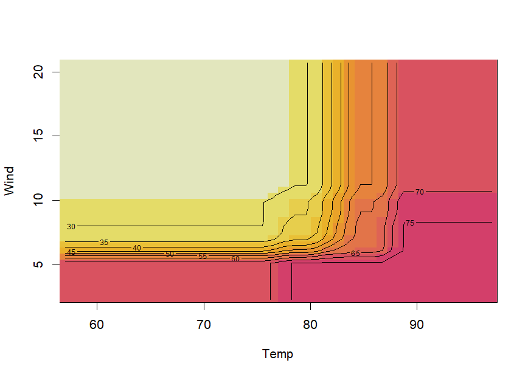

# **`pre`**: an R package for deriving prediction rule ensembles

## Contents

-   [Introduction](#introduction)
-   [Example: A rule ensemble for predicting ozone
    levels](#example-a-rule-ensemble-for-predicting-ozone-levels)
-   [Tools for interpretation](#tools-for-interpretation)
    -   [Importance measures](#importance-measures)
    -   [Explaining individual
        predictions](#explaining-individual-predictions)
    -   [Partial dependence plots](#partial-dependence-plots)
    -   [Assessing presence of
        interactions](#assessing-presence-of-interactions)
    -   [Correlations between selected
        terms](#correlations-between-selected-terms)
-   [Tuning parameters of function pre](#tuning-parameters)
-   [Dealing with missing values](#dealing-with-missing-values)
-   [Go sparser with relaxed lasso
    fits](#go-sparser-with-relaxed-lasso-fits)
-   [Generalized Prediction Ensembles: Combining MARS, rules and linear
    terms](#generalized-prediction-ensembles-combining-mars-rules-and-linear-terms)
-   [Credits](#credits)
-   [References](#references)

## Introduction

**`pre`** is an **R** package for deriving prediction rule ensembles for
binary, multinomial, (multivariate) continuous, count and survival
responses. Input variables may be numeric, ordinal and categorical. An
extensive description of the implementation and functionality is
provided in Fokkema (2020). The package largely implements the algorithm
for deriving prediction rule ensembles as described in Friedman &
Popescu (2008), with several adjustments:

1.  The package is completely **`R`** based, allowing users better
    access to the results and more control over the parameters used for
    generating the prediction rule ensemble.
2.  The unbiased tree induction algorithms of Hothorn, Hornik, &
    Zeileis (2006) is used for deriving prediction rules, by default.
    Alternatively, the (g)lmtree algorithm of Zeileis, Hothorn, &
    Hornik (2008) can be employed, or the classification and regression
    tree (CART) algorithm of Breiman, Friedman, Olshen, & Stone (1984).
3.  The package supports a wider range of response variable types.
4.  The initial ensemble may be generated as a bagged, boosted and/or
    random forest ensemble.
5.  Hinge functions of predictor variables may be included as
    baselearners, as in the multivariate adaptive regression splines
    (MARS) approach of Friedman (1991), using function `gpe()`.
6.  Tools for explaining individual predictions are provided.

Note that **`pre`** is under development, and much work still needs to
be done. Below, an introduction the the package is provided. Fokkema
(2020) provides an extensive description of the fitting procedures
implemented in function `pre()` and example analyses with more extensive
explanations. An extensive introduction aimed at researchers in social
sciences is provided in Fokkema & Strobl (2020).

## Example: A rule ensemble for predicting ozone levels

To get a first impression of how function `pre()` works, we will predict
Ozone levels using the `airquality` dataset. We fit a prediction rule
ensemble using function `pre()`:

``` r
library("pre")
airq <- airquality[complete.cases(airquality), ]
set.seed(42)
airq.ens <- pre(Ozone ~ ., data = airq)
```

Note that it is necessary to set the random seed, to allow for later
replication of results, because the fitting procedure depends on random
sampling of training observations.

We can print the resulting ensemble (alternatively, we could use the
`print` method):

``` r
airq.ens
#> 
#> Final ensemble with cv error within 1se of minimum: 
#> 
#>   lambda =  3.543968
#>   number of terms = 12
#>   mean cv error (se) = 352.395 (99.13754)
#> 
#>   cv error type : Mean-Squared Error
#> 
#>          rule   coefficient                          description
#>   (Intercept)   68.48270407                                    1
#>       rule191  -10.97368180              Wind > 5.7 & Temp <= 87
#>       rule173  -10.90385519              Wind > 5.7 & Temp <= 82
#>        rule42   -8.79715538              Wind > 6.3 & Temp <= 84
#>       rule204    7.16114781         Wind <= 10.3 & Solar.R > 148
#>        rule10   -4.68646145              Temp <= 84 & Temp <= 77
#>       rule192   -3.34460038  Wind > 5.7 & Temp <= 87 & Day <= 23
#>        rule51   -2.27864287              Wind > 5.7 & Temp <= 84
#>        rule93    2.18465676              Temp > 77 & Wind <= 8.6
#>        rule74   -1.36479545              Wind > 6.9 & Temp <= 84
#>        rule28   -1.15326093              Temp <= 84 & Wind > 7.4
#>        rule25   -0.70818400              Wind > 6.3 & Temp <= 82
#>       rule166   -0.04751152              Wind > 6.9 & Temp <= 82
```

The first few lines of the printed results provide the penalty parameter
value (*λ*) employed for selecting the final ensemble. By default, the
‘1-SE’ rule is used for selecting *λ*; this default can be overridden by
employing the `penalty.par.val` argument of the `print` method and other
functions in the package. Note that the printed cross-validated error is
calculated using the same data as was used for generating the rules and
likely provides an overly optimistic estimate of future prediction
error. To obtain a more realistic prediction error estimate, we will use
function `cvpre()` later on.

Next, the printed results provide the rules and linear terms selected in
the final ensemble, with their estimated coefficients. For rules, the
`description` column provides the conditions. For linear terms (which
were not selected in the current ensemble), the winsorizing points used
to reduce the influence of outliers on the estimated coefficient would
be printed in the `description` column. The `coefficient` column
presents the estimated coefficient. These are regression coefficients,
reflecting the expected increase in the response for a unit increase in
the predictor, keeping all other predictors constant. For rules, the
coefficient thus reflects the difference in the expected value of the
response when the conditions of the rule are met, compared to when they
are not.

Using the `plot` method, we can plot the rules in the ensemble as simple
decision trees. Here, we will request the nine most important
baselearners through specification of the `nterms` argument. Through the
`cex` argument, we specify the size of the node and path labels:

``` r
plot(airq.ens, nterms = 9, cex = .5)
```


Using the `coef` method, we can obtain the estimated coefficients for
each of the baselearners (we only print the first six terms here for
space considerations):

``` r
coefs <- coef(airq.ens)
coefs[1:6, ]
#>            rule coefficient                  description
#> 201 (Intercept)   68.482704                            1
#> 167     rule191  -10.973682      Wind > 5.7 & Temp <= 87
#> 150     rule173  -10.903855      Wind > 5.7 & Temp <= 82
#> 39       rule42   -8.797155      Wind > 6.3 & Temp <= 84
#> 179     rule204    7.161148 Wind <= 10.3 & Solar.R > 148
#> 10       rule10   -4.686461      Temp <= 84 & Temp <= 77
```

We can generate predictions for new observations using the `predict`
method (only the first six predicted values are printed here for space
considerations):

``` r
predict(airq.ens, newdata = airq[1:6, ])
#>        1        2        3        4        7        8 
#> 32.53896 24.22456 24.22456 24.22456 31.38570 24.22456
```

Using function `cvpre()`, we can assess the expected prediction error of
the fitted PRE through *k*-fold cross validation (*k* = 10, by default,
which can be overridden through specification of the `k` argument):

``` r
set.seed(43)
airq.cv <- cvpre(airq.ens)
#> $MSE
#>       MSE        se 
#> 369.92747  88.65343 
#> 
#> $MAE
#>       MAE        se 
#> 13.666860  1.290329
```

The results provide the mean squared error (MSE) and mean absolute error
(MAE) with their respective standard errors. These results are saved for
later use in `aiq.cv$accuracy`. The cross-validated predictions, which
can be used to compute alternative estimates of predictive accuracy, are
saved in `airq.cv$cvpreds`. The folds to which observations were
assigned are saved in `airq.cv$fold_indicators`.

For tuning the parameters of function `pre()` so as to obtain optimal
predictive accuracy, users are advised to use **`R`** package
**`caret`**. A tutorial is provided as a vignette, accessible by typing
`vignette("tuning", package = "pre")` in **`R`** or by going to
<https://cran.r-project.org/package=pre/vignettes/missingness.html> in a
browser and clicking on the corresponding link to the vignette.

## Tools for interpretation

Package **`pre`** provides several additional tools for interpretation
of the final ensemble. These may be especially helpful for complex
ensembles containing many rules and linear terms.

### Importance measures

We can assess the relative importance of input variables as well as
baselearners using the `importance()` function:

``` r
imps <- importance(airq.ens, round = 4)
```


As we already observed in the printed ensemble, the plotted variable
importances indicate that Temperature and Wind are most strongly
associated with Ozone levels. Solar.R and Day are also associated with
Ozone levels, but much less strongly. Variable Month is not plotted,
which means it obtained an importance of zero, indicating that it is not
associated with Ozone levels. We already observed this in the printed
ensemble: Month did not appear in any of the selected terms. The
variable and baselearner importances are saved for later use in
`imps$varimps` and `imps$baseimps`, respectively.

### Explaining individual predictions

We can obtain explanations of the predictions for individual
observations using function `explain()`:

``` r
par(mfrow = c(1, 2))
expl <- explain(airq.ens, newdata = airq[1:2, ], cex = .8)
```


The values of the rules and linear terms for each observation are saved
in `expl$predictors`, their contributions in `expl$contribution` and the
predicted values in `expl$predicted.value`.

### Partial dependence plots

We can obtain partial dependence plots to assess the effect of single
predictor variables on the outcome using the `singleplot()` function:

``` r
singleplot(airq.ens, varname = "Temp")
```


We can obtain partial dependence plots to assess the effects of pairs of
predictor variables on the outcome using the `pairplot()` function:

``` r
pairplot(airq.ens, varnames = c("Temp", "Wind"))
```



Note that creating partial dependence plots is computationally intensive
and computation time will increase fast with increasing numbers of
observations and numbers of variables. Milborrow’s (2018) **`plotmo`**
package provides more efficient functions for plotting partial
dependence, which also support `pre` models.

If the final ensemble does not contain many terms, inspecting individual
rules and linear terms through the `print` method may be more
informative than partial dependence plots. One of the main advantages of
prediction rule ensembles is their interpretability: the predictive
model contains only simple functions of the predictor variables (rules
and linear terms), which are easy to grasp. Partial dependence plots are
often much more useful for interpretation of complex models, like random
forests for example.

### Assessing presence of interactions

We can assess the presence of interactions between the input variables
using the `interact()` and `bsnullinteract()` funtions. Function
`bsnullinteract()` computes null-interaction models (10, by default)
based on bootstrap-sampled and permuted datasets. Function `interact()`
computes interaction test statistics for each predictor variables
appearing in the specified ensemble. If null-interaction models are
provided through the `nullmods` argument, interaction test statistics
will also be computed for the null-interaction model, providing a
reference null distribution.

Note that computing null interaction models and interaction test
statistics is computationally very intensive, so running the following
code will take some time:

``` r
set.seed(44)
nullmods <- bsnullinteract(airq.ens)
int <- interact(airq.ens, nullmods = nullmods)
```


The plotted variable interaction strengths indicate that Temperature and
Wind may be involved in interactions, as their observed interaction
strengths (darker grey) exceed the upper limit of the 90% confidence
interval (CI) of interaction stengths in the null interaction models
(lighter grey bar represents the median, error bars represent the 90%
CIs). The plot indicates that Solar.R and Day are not involved in any
interactions. Note that computation of null interaction models is
computationally intensive. A more reliable result can be obtained by
computing a larger number of boostrapped null interaction datasets, by
setting the `nsamp` argument of function `bsnullinteract()` to a larger
value (e.g., 100).

### Correlations between selected terms

We can assess correlations between the baselearners appearing in the
ensemble using the `corplot()` function:

``` r
corplot(airq.ens)
```


## Tuning parameters

To obtain an optimal set of model-fitting parameters, package
**`caret`** Kuhn (2008) provides a method `"pre"`. For a manual on how
to optimize the parameters of function `pre` using **`caret`**’s `train`
function, see the vignette on tuning:

``` r
vignette("tuning", package = "pre")
```

or go to <https://cran.r-project.org/package=pre/vignettes/tuning.html>
in a browser.

## Dealing with missing values

Some suggestions on how to deal with missing values are provided in the
following vignette:

``` r
vignette("missingness", package = "pre")
```

or go to
<https://cran.r-project.org/package=pre/vignettes/missingness.html> in a
browser.

## Go sparser with relaxed lasso fits

When sparsity (i.e., a final ensemble comprising only few terms) is of
central importance, the so-called relaxed lasso can be employed. It
allows for retaining a pre-specified (low) number of terms, with
adequate predictive accuracy. An introduction and tutorial is provided
in the following vignette:

``` r
vignette("relaxed", package = "pre")
```

## Generalized Prediction Ensembles: Combining MARS, rules and linear terms

An even more flexible ensembling approach is implemented in function
`gpe()`, which allows for fitting Generalized Prediction Ensembles: It
combines the MARS (multivariate Adaptive Splines) approach of Friedman
(1991) with the RuleFit approach of Friedman & Popescu (2008). In other
words, `gpe()` fits an ensemble composed of hinge functions (possibly
multivariate), prediction rules and linear functions of the predictor
variables. See the following example:

``` r
set.seed(42)
airq.gpe <- gpe(Ozone ~ ., data = airquality[complete.cases(airquality),], 
    base_learners = list(gpe_trees(), gpe_linear(), gpe_earth()))
airq.gpe
#> 
#> Final ensemble with cv error within 1se of minimum: 
#> 
#>   lambda =  3.229132
#>   number of terms = 11
#>   mean cv error (se) = 359.2623 (110.8863)
#> 
#>   cv error type : Mean-squared Error
#> 
#>                                   description  coefficient
#>                                   (Intercept)  65.52169488
#>                                    Temp <= 77  -6.20973855
#>                  Wind <= 10.3 & Solar.R > 148   5.46410966
#>                       Wind > 5.7 & Temp <= 82  -8.06127415
#>                       Wind > 5.7 & Temp <= 84  -7.16921733
#>                       Wind > 5.7 & Temp <= 87  -8.04255471
#>           Wind > 5.7 & Temp <= 87 & Day <= 23  -3.40525575
#>                       Wind > 6.3 & Temp <= 82  -2.71925536
#>                       Wind > 6.3 & Temp <= 84  -5.99085126
#>                       Wind > 6.9 & Temp <= 82  -0.04406376
#>                       Wind > 6.9 & Temp <= 84  -0.55827336
#>   eTerm(Solar.R * h(9.7 - Wind), scale = 410)   9.91783320
#> 
#>   'h' in the 'eTerm' indicates the hinge function
```

The results indicate that several rules, a single hinge (linear spline)
function, and no linear terms were selected for the final ensemble. The
hinge function and its coefficient indicate that Ozone levels increase
with increasing solar radiation and decreasing wind speeds. The
prediction rules in the ensemble indicate a similar pattern.

## Credits

I am very grateful to package co-author Benjamin Chistoffersen:
<https://github.com/boennecd>, who developed `gpe` and contributed
tremendously by improving functions, code and computational aspects.
Furthermore, I am grateful for the many helpful suggestions of Stephen
Milborrow, and for the contributions of Karl Holub
(<https://github.com/holub008>) and Advik Shreekumar
(<https://github.com/adviksh>).

## References

<div id="refs" class="references csl-bib-body hanging-indent"
line-spacing="2">

<div id="ref-Breiman84" class="csl-entry">

Breiman, L., Friedman, J., Olshen, R., & Stone, C. (1984).
Classification and regression trees. Boca Raton, FL: Chapman & Hall /
CRC.

</div>

<div id="ref-Fokkema20" class="csl-entry">

Fokkema, M. (2020). Fitting prediction rule ensembles with R package
pre. *Journal of Statistical Software*, *92*(12), 1–30. Retrieved from
<https://doi.org/10.18637/jss.v092.i12>

</div>

<div id="ref-FokkemaStrobl20" class="csl-entry">

Fokkema, M., & Strobl, C. (2020). <span class="nocase">Fitting
prediction rule ensembles to psychological research data: An
introduction and tutorial</span>. *Psychological Methods*, *25*(5),
636–652. <https://doi.org/10.1037/met0000256>

</div>

<div id="ref-Friedman91" class="csl-entry">

Friedman, J. (1991). Multivariate adaptive regression splines. *The
Annals of Statistics*, *19*, 1–67.

</div>

<div id="ref-Friedman08" class="csl-entry">

Friedman, J., & Popescu, B. (2008). Predictive learning via rule
ensembles. *The Annals of Applied Statistics*, *2*(3), 916–954.

</div>

<div id="ref-Hothorn06" class="csl-entry">

Hothorn, T., Hornik, K., & Zeileis, A. (2006). Unbiased recursive
partitioning: A conditional inference framework. *Journal of
Computational and Graphical Statistics*, *15*(3), 651–674.

</div>

<div id="ref-Kuhn08" class="csl-entry">

Kuhn, M. (2008). Building predictive models in R using the caret
package. *Journal of Statistical Software*, *28*(5), 1–26.

</div>

<div id="ref-Milb18" class="csl-entry">

Milborrow, S. (2018). *<span class="nocase">plotmo</span>: Plot a
model’s residuals, response, and partial dependence plots*. Retrieved
from <https://CRAN.R-project.org/package=plotmo>

</div>

<div id="ref-Zeileis08" class="csl-entry">

Zeileis, A., Hothorn, T., & Hornik, K. (2008). Model-based recursive
partitioning. *Journal of Computational and Graphical Statistics*,
*17*(2), 492–514.

</div>

</div>
